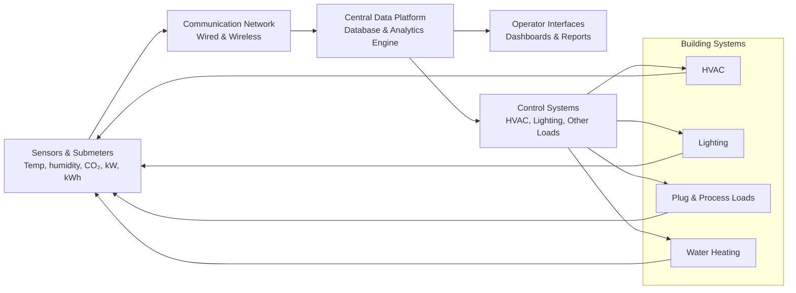

"Smart BMS"

[[content-areas/AI-Factories-Datacenters/Organizations/Edviro|Edviro]]

# Defining and Describing Building Energy Management Systems

_A building energy management system is essentially a digital “brain” that watches how a building uses energy and continuously tweaks systems to cut waste while keeping people comfortable._ [^wmw16c] [^670bol] [^cmdx42]

A **Building Energy Management System (BEMS)** is a combination of hardware (sensors, meters, controllers) and software that *monitors, analyzes, and optimizes* energy use across building systems such as HVAC, lighting, and other major loads. [^wmw16c] [^670bol] [^cmdx42] It operates as a centralized, software‑driven platform providing real‑time monitoring and integrated control of energy‑consuming systems to reduce power use while maintaining occupant comfort and safety. [^wmw16c] [^670bol] BEMS are most often deployed in commercial buildings and campuses but are increasingly applied to small and medium buildings as costs fall and connectivity improves. [^670bol] [^cmdx42] [^7v81nb] They matter because they turn raw building data into actionable insights and automated control actions that lower energy costs, improve sustainability performance, and support regulatory compliance and grid interaction. [^wmw16c] [^670bol] [^cmdx42] [^8t325k]

# Uses in Context

- Vendors and practitioners use “building energy management system” to describe a **centralized, software‑driven platform that provides real‑time monitoring and integrated control of lighting, power, hot water, HVAC, and other energy‑consuming systems** in order to “reduce power use while maintaining occupant comfort and safety.” [^wmw16c]

- Facilities and energy teams use the term to mean **“a set of software and hardware tools that help organizations monitor, control, and optimize energy consumption in buildings,”** connecting to HVAC, lighting, and other major loads. [^670bol]

- In smart‑building and IoT discussions, BEMS is invoked as the **modern evolution of traditional building management systems**, integrating IoT sensors, AI, and real‑time analytics so the system “learns from building and occupants’ behavior, predicts needs, and reacts in real time.” [^45713j] [^cmdx42]

- Policy and efficiency organizations refer to “building energy management control systems” as tools commonly used to “monitor and control many building systems, particularly energy‑using systems such as cooling, heating, ventilation, and lighting,” highlighting their role in commercial energy efficiency programs. [^7v81nb]

- In energy‑management literature, BEMS are framed as enabling “real‑time monitoring and control of energy usage,” improving occupant comfort and supporting sustainability goals by integrating with advanced technologies such as IoT and renewables. [^cmdx42]

- Grid‑integration research uses “home and building energy management systems” to describe systems that coordinate appliances and distributed energy resources (like rooftop PV) so that building energy use can provide value to the electric grid. [^8t325k]

# History of Use

## Origins

- Early **energy management systems for buildings** emerged alongside digital building automation in the late 1970s–1980s, as microprocessor‑based controls began to monitor and optimize HVAC and lighting in large commercial buildings; this laid the technical foundation for what is now called BEMS. [^7v81nb] [^9x07bo] (Historical framing inferred from energy‑management and control‑system literature; the specific acronym BEMS gained currency later.)

- Academic and technical use of the specific phrase **“Building Energy Management Systems (BEMS)”** was established by the 2000s; literature reviews describe BEMS as systems that “allow for real‑time monitoring and control of energy usage” and consolidate various applications under one framework. [^cmdx42]

- The term has been widely adopted in building‑performance practice and vendor offerings to distinguish **energy‑focused analytics and optimization** from broader building management/control systems, which primarily handle operational control and life‑safety functions. [^670bol] [^jrrns3] [^cmdx42]

## Evolution

- **2000s–early 2010s – From controls to analytics‑oriented BEMS**  
  As sensor, metering, and networking costs fell, BEMS evolved from simple scheduling and set‑point control to platforms that “monitor, analyze, and optimize a building’s energy use,” using data from sensors and meters for deeper analytics. [^670bol] [^cmdx42]

- **Mid‑2010s – Integration with IoT and cloud platforms**  
  Research and vendors began explicitly describing **smart building energy management systems** that integrate IoT sensors, cloud computing, and real‑time analytics, moving from static rule‑based logic to adaptive, data‑driven optimization. [^45713j] [^cmdx42]

- **Late 2010s–2020s – Portfolio‑scale and grid‑interactive BEMS**  
  Modern BEMS architectures can “scale to integrate data from multiple facilities or even the entire real estate portfolio” and are being researched as **home and building energy management systems** that coordinate distributed energy resources and provide services to the grid. [^45713j] [^8t325k]

# Best Real-World Examples

- **[Facilio BEMS](https://facilio.com/learn/building-energy-management-system/)** – A cloud‑based platform that “sits on top of your building systems and continuously analyzes how energy is being used,” adding real‑time monitoring, fault detection, optimization, and analytics. [^670bol]

- **[CoolAutomation Building Energy Management Systems](https://coolautomation.com/blog/building-energy-management-systems/)** – Vendor solution emphasizing centralized, software‑driven control of HVAC, lighting, and other systems to enhance energy efficiency while maintaining comfort and safety. [^wmw16c]

- **[EnergyCAP BEMS / building energy monitoring](https://www.energycap.com/blog/building-energy-monitoring/)** – Energy‑monitoring software positioned as a “complete BEMS guide,” focusing on tracking electricity, gas, steam, and water use across facilities to spot waste and reduce costs. [^a0ae5k]

- **[OPInno Smart BEMS](https://op-int.com/smart-building-energy-management-system/)** – A “smart building energy management system” that integrates IoT sensors, AI, and real‑time analytics to dynamically manage HVAC, lighting, power grids, and water systems, offering centralized control with granular, real‑time insights. [^45713j]

- **[NREL / NLR Home and Building Energy Management Systems research](https://www.nlr.gov/grid/energy-management)** – Research initiative developing tools to understand how smart homes and buildings, including appliances and distributed energy resources, can be coordinated through energy management systems to provide value to the grid. [^8t325k]

- **[ACEEE work on building energy management control systems](https://www.aceee.org/topic-brief/2025/11/building-energy-management-control-systems-small-and-medium-commercial)** – Programmatic and policy‑oriented example analyzing how building energy management control systems are used in large buildings and how to extend them to small and medium commercial buildings. [^7v81nb]

# Case Studies

**Case Study 1 – Cloud BEMS as an overlay on existing controls (Facilio)**  
Facilio describes its Building Energy Management System as a **software‑driven overlay** that connects to existing building systems—HVAC, lighting, and other major loads—to monitor, analyze, and optimize energy use without replacing underlying building management systems. [^670bol] The platform “sits on top of your building systems and continuously analyzes how energy is being used,” turning raw operational data into insights and automated optimization, including real‑time monitoring, fault detection, and analytics. [^670bol] In practice, this allows building operators to identify inefficiencies, such as simultaneous heating and cooling or poorly tuned schedules, and then implement automated or guided changes that reduce waste, cut energy costs, and improve building performance while preserving occupant comfort. [^670bol] [^cmdx42] This case illustrates how modern BEMS are increasingly decoupled from hardware, leveraging cloud analytics and integration with existing BMS/controls to deliver energy savings as a service layer. [^670bol] [^jrrns3] [^cmdx42]

**Case Study 2 – Smart BEMS with IoT and AI for adaptive control (OPInno)**  
OPInno frames a **smart building energy management system** as the “modern evolution of BMS” that integrates intelligence, adaptability, and automation. [^45713j] In their model, IoT sensors continuously collect data on occupancy and environmental conditions; this data is transmitted to a central processing hub where “all the big calculations happen,” and the system then forwards instructions to control systems managing HVAC, lighting, power grids, and water systems. [^45713j] By leveraging AI and real‑time analytics, the system “learns from building and occupants’ behavior, predicts needs, and reacts in real time,” and can scale to integrate data from multiple facilities or an entire real estate portfolio. [^45713j] Such deployments demonstrate how BEMS have evolved from static schedules to predictive, portfolio‑wide optimization, enabling operators to move from reactive control to proactive, data‑driven decision‑making that simultaneously cuts costs, boosts sustainability, and enhances tenant experiences. [^45713j] [^cmdx42]

**Case Study 3 – Extending BEMS concepts to small and medium commercial buildings (ACEEE)**  
[[content-areas/AI-Factories-Datacenters/Organizations/The American Council for an Energy‑Efficient Economy]] (ACEEE) notes that **building energy management control systems** are common in large commercial buildings over 100,000 square feet but remain “much rarer in small and medium sized buildings.” [^7v81nb] Its topic brief examines how these systems are used to monitor and control cooling, heating, ventilation, and lighting and identifies barriers to adoption in smaller buildings, such as cost, lack of technical expertise, and split incentives between owners and tenants. [^7v81nb] The paper also discusses program and policy approaches to increasing use—such as incentives, simplified system offerings, and technical assistance—highlighting the potential for BEMS‑style capabilities to deliver significant energy savings if they can be made accessible to this underserved segment. [^7v81nb] [^cmdx42] This case underscores that the core BEMS concept is proven in large facilities but that realizing its full societal impact depends on overcoming deployment barriers in smaller commercial buildings.

# Market Category Exploration

***

# Sources

[^wmw16c]: [Understanding Building Energy Management Systems](https://coolautomation.com/blog/building-energy-management-systems/)
[^670bol]: [What is a Building Energy Management System (BEMS)? - Facilio](https://facilio.com/learn/building-energy-management-system/)
[^45713j]: [Smart Building Energy Management System: The Future of Efficient ...](https://op-int.com/smart-building-energy-management-system/)
[^jrrns3]: [EMS vs BMS: Key differences between building and energy ...](https://www.mrisoftware.com/ae/blog/ems-vs-bms-key-differences-building-energy-management-systems/)
[^cmdx42]: [A Review of Smart Building Energy Management Systems (BEMS ...](https://easychair.org/publications/paper/1qDQ)
[^7v81nb]: [Building Energy Management Control Systems for Small and ...](https://www.aceee.org/topic-brief/2025/11/building-energy-management-control-systems-small-and-medium-commercial)
[^8t325k]: [Home and Building Energy Management Systems](https://www.nlr.gov/grid/energy-management)
[^9x07bo]: [What is…Energy Management? | Building Geniuses - KMC Controls](https://www.kmccontrols.com/blog/what-is-energy-management/)
[^a0ae5k]: [What is building energy monitoring? A complete BEMS guide](https://www.energycap.com/blog/building-energy-monitoring/)

# Building Energy Management Systems

Building Energy Management Systems (BEMS) have emerged as a distinct and rapidly maturing layer in the broader landscape of building automation and energy optimization, sitting at the intersection of operational technology, data analytics, and sustainability strategy. [^xt7941] [^vw08kh] [^x4nrqn] They transform previously siloed building controls into an integrated, intelligence-driven platform that continuously monitors, analyzes, and optimizes the energy performance of commercial and, increasingly, residential buildings. [^xt7941] [^x4nrqn] [^zg3rlu] As regulatory pressure, rising energy prices, and corporate decarbonization commitments converge, BEMS are evolving from optional efficiency tools into core enterprise infrastructure that underpins compliance, ESG reporting, and long‑term asset value. [^xt7941] [^x4nrqn] [^jqmvc0] This profile maps the boundaries of the BEMS market category, traces the forces that made it salient now, examines current market dynamics, and surfaces the key incumbent, challenger, and innovator firms shaping its trajectory.

## Snapshot

_At its core, the Building Energy Management Systems category comprises software‑and‑hardware platforms that sit on top of existing building controls to continuously monitor, analyze, and optimize energy consumption across HVAC, lighting, and other mechanical and electrical systems, turning building data into actionable “energy intelligence” for operators and owners. [^xt7941] [^vw08kh] [^e9bh88] In practice, BEMS solutions provide centralized visibility and algorithmic control that enable buildings to use less energy without sacrificing comfort, safety, or productivity, while increasingly serving as a backbone for ESG reporting and regulatory compliance. [^xt7941] [^vw08kh] [^x4nrqn]_

> “The Global Building Energy Management Systems Market, valued at USD 40.10 Billion in 2024, is projected to experience a CAGR of 15.60% to reach USD 95.72 Billion by 2030.” [^pju481]

The BEMS category encompasses platforms and services that monitor, control, and optimize energy use in buildings, distinct from broader energy management systems and from generic building management systems that focus primarily on operational control rather than systematic energy optimization. [^xt7941] [^vw08kh] [^x4nrqn] [^8i4auj] [^pju481] This profile focuses on the period from roughly 2020 through the early 2030s, when BEMS have shifted from niche deployments to a global growth market, driven by decarbonization, digitization of real estate, and new regulatory frameworks such as the European Union’s revised Energy Performance of Buildings Directive (EPBD). [^x4nrqn] [^jqmvc0] [^k4fa47] [^om7rtu] [^5ou37y] It is worth a dedicated reference card now because multiple market‑sizing studies forecast high‑single‑ to mid‑teens CAGR, regulatory standards are crystallizing what “smart” and efficient building operations must look like, and capital is flowing into both incumbent expansions and AI‑driven innovators that could redefine the category’s scope. [^x4nrqn] [^bbjfa4] [^pju481] [^jqmvc0] [^7pp5zc] [^7bshut]

## What is this Market Category?

A Building Energy Management System is typically defined as a centralized, computer‑based platform that monitors, analyzes, and controls energy‑consuming equipment in a building—especially HVAC, lighting, and power systems—in order to optimize efficiency, reduce operating costs, and support sustainability goals. [^xt7941] [^vw08kh] [^x4nrqn] [^pju481] IBM describes a BEMS as “a technology platform that monitors and optimizes energy performance and helps reduce energy usage,” emphasizing that it uses sensors, smart meters, and automation to track energy metrics, find inefficiencies, and automate tasks related to heating, cooling, and lighting while also generating compliance reports for energy auditing and emissions. [^xt7941] Johnson Controls characterizes BEMS as an “energy intelligence layer” that sits above existing building systems, continuously monitoring building and asset performance, detecting anomalies, and feeding insights back into building automation systems for corrective action and predictive maintenance. [^vw08kh] The Climate Technology Centre and Network (CTCN), citing the International Energy Agency, similarly underscores that BEMS are sophisticated electrical control and monitoring systems that integrate data storage, communication, and central operator terminals to manage HVAC, lighting, fire alarms, security, and maintenance functions, with energy management as a core objective. [^zg3rlu]

In terms of problems solved, BEMS address several intertwined pain points for building owners, operators, and corporate sustainability teams. First, they tackle the visibility gap: many buildings traditionally operate with fragmented control systems that provide limited real‑time insight into where, when, and how energy is consumed, wasted, or lost. [^xt7941] [^e9bh88] [^5hutkk] By integrating data from sensors, meters, controllers, and existing building management systems, BEMS create a unified view of energy performance across systems and zones, enabling operators to identify patterns of inefficient operation, such as equipment running out of schedule, poorly tuned setpoints, or simultaneous heating and cooling. [^xt7941] [^vw08kh] [^e9bh88] [^5hutkk] Second, they provide a decision and automation layer that can algorithmically optimize energy use, for instance by adjusting HVAC operation based on occupancy and weather forecasts, dimming lighting in response to daylight availability, or orchestrating demand response to reduce peak load charges. [^xt7941] [^vw08kh] [^x4nrqn] [^5hutkk] [^8i4auj] Third, BEMS increasingly serve as compliance and reporting tools, benchmarking facility performance against baselines, supporting greenhouse gas inventorying, and streamlining data collection for environmental, social, and governance (ESG) disclosures and regulatory audits. [^xt7941] [^x4nrqn] [^jqmvc0]

The primary customer segments for BEMS are operators and owners of commercial and institutional buildings—such as office towers, campuses, hospitals, data centers, retail complexes, and industrial facilities—who have significant energy spend and face regulatory or corporate pressure to improve efficiency. [^xt7941] [^vw08kh] [^x4nrqn] [^jqmvc0] [^m89p1w] [^bcnr1j] Fortune Business Insights notes that commercial buildings and complexes will hold a dominant share of the broader energy management system market due to rising focus on reducing energy costs, regulatory mandates for energy efficiency, and adoption of innovative building technologies, and that BEMS constitute a distinct system type within this EMS market alongside home and industrial energy management systems. [^jqmvc0] Residential and smart home deployments of BEMS‑like technologies are less common but growing, especially in multi‑unit residential buildings and smart home ecosystems where energy optimization is becoming a priority. [^zg3rlu] [^jqmvc0] Within organizations, buyers and users typically include facilities managers, energy or sustainability managers, corporate real estate teams, and sometimes utility executives managing large portfolios of buildings. [^xt7941] [^jqmvc0] [^7bshut] [^bcnr1j]

Clarifying the boundary of the category is essential, because terms like Building Management System (BMS), Building Automation System (BAS), Energy Management System (EMS), and Building Energy Management System (BEMS) are often used interchangeably in practice. [^vw08kh] [^5hutkk] [^8i4auj] [^zg3rlu] [^jqmvc0] [^5ewv0y] A BMS or BAS is primarily concerned with monitoring and controlling building systems—HVAC, lighting, security, fire protection—through schedules and setpoints, offering centralized operational control and occupant comfort management. [^vw08kh] [^8i4auj] [^5ewv0y] By contrast, a BEMS is explicitly focused on energy efficiency and data‑driven optimization: it sits on top of or is integrated into BMS/BAS infrastructure to analyze energy data across systems, detect anomalies, benchmark performance, and recommend or enact changes that reduce energy consumption and cost. [^xt7941] [^vw08kh] [^x4nrqn] [^e9bh88] Energy.gov notes that depending on configuration, a BMS may be known as a BEMS or integrated with specialized EMS, but in regulatory and analyst contexts, BEMS usually denotes systems whose primary purpose is energy monitoring and optimization rather than general building operations. [^8i4auj] [^jqmvc0] The broader EMS market includes industrial energy management systems (IEMS) that manage plant processes, and home energy management systems (HEMS) focused on residential devices, both of which are outside the strict BEMS category even though they share concepts and sometimes vendors. [^jqmvc0]

The key exclusion in this category is generalized building automation systems that do not provide robust energy analytics, benchmarking, or optimization capabilities, even if they monitor and control energy‑related equipment. [^vw08kh] [^x4nrqn] [^5hutkk] [^8i4auj] Also excluded are purely hardware devices such as standalone smart thermostats or occupancy sensors that lack a centralized analytic and control platform, unless they are components within a wider BEMS solution. [^x4nrqn] [^5hutkk] [^zg3rlu] Industrial process control systems and factory energy management platforms are likewise considered adjacent but separate categories, given their distinct operational characteristics and regulatory regimes, even when they share technologies with building‑focused systems. [^jqmvc0] [^5ewv0y] However, the boundary is fuzzy and disputed around integrated platforms that span buildings and industrial sites, and around advanced building automation systems that incorporate energy features; some operators and vendors argue that any BACs compliant with standards like EN ISO 52120‑1 or EPBD requirements effectively function as BEMS, while others reserve the term for solutions with more advanced analytics and portfolio‑level optimization capabilities. [^k4fa47] [^om7rtu] [^5ou37y]

### BEMS versus BMS/BAS: Functional Distinctions

Although there is overlap in terminology, multiple sources emphasize a functional distinction between BEMS and traditional BMS/BAS that helps clarify the category boundary. [^vw08kh] [^x4nrqn] [^8i4auj] [^zg3rlu] Johnson Controls describes the BAS as the foundation that automates mechanical and electrical systems using schedules and setpoints, the BMS as building on that foundation by adding centralized monitoring and control across HVAC, lighting, and power, and the BEMS as adding an energy intelligence layer that performs cross‑system analysis of energy use, anomaly detection, benchmarking, and predictive modeling. [^vw08kh] IBM similarly notes that while a BMS mechanically tracks electrical, mechanical, and security equipment, it is “not really built for higher‑level thought,” which is where the BEMS comes in to apply complex algorithms to utility and sensor data and extrapolate ways to reduce energy costs. [^xt7941] The Australian government’s energy portal reinforces this by describing BMS applications as offering automated control and optimization of equipment cycles with algorithms focused on energy efficiency, but also noting that BMS are increasingly integrated with grid‑responsive demand management systems or specialized EMS, implying a layered architecture where dedicated energy management platforms add sophistication. [^8i4auj]

The ACEEE report uses the term Building Energy Management and Control Systems (BEMCS) interchangeably with EMS or BMS to describe systems designed to monitor, control, and optimize energy use within a building, but it underscores that these systems include both hardware and software, rely on sensors, metering devices, controllers, communication networks, and user interfaces, and enable real‑time monitoring and intelligent control based on data. [^5hutkk] CTCN’s overview goes further by highlighting communication as the differentiating attribute: whereas previous control systems operated in isolation, BEMS provide centralized communication and data exchange across building functions, enabling integrated decision‑making at a principal operator station connected to remote outstations or controllers. [^zg3rlu] In practice, these distinctions mean that a given vendor’s product may straddle BMS and BEMS functions; category analysts focus on offerings whose core value proposition is energy optimization, advanced analytics, and portfolio‑level management rather than just basic automation.

To crystallize these differences, it is useful to compare typical BMS and BEMS capabilities along key dimensions. Johnson Controls provides a structured comparison that distinguishes primary purpose, focus, scope, energy intelligence, predictive maintenance, and integration, which can be synthesized as follows based on its narrative. [^vw08kh]

| Dimension               | Building Management System (BMS/BAS)                                                                 | Building Energy Management System (BEMS)                                                                                   |
|-------------------------|------------------------------------------------------------------------------------------------------|---------------------------------------------------------------------------------------------------------------------------|
| Primary purpose         | Monitor and control building systems for comfort, safety, and basic efficiency. [^vw08kh] [^8i4auj]              | Monitor and optimize energy performance across building systems to reduce consumption and costs. [^xt7941] [^vw08kh] [^x4nrqn] [^pju481]             |
| Focus                   | All building systems (HVAC, security, fire, access, etc.). [^vw08kh] [^8i4auj]                                   | Energy efficiency and data‑driven optimization across HVAC, lighting, plug loads, and power. [^vw08kh] [^x4nrqn] [^e9bh88] [^pju481]                 |
| Scope                   | Operational control via schedules, setpoints, and alarms. [^vw08kh] [^8i4auj]                                     | Cross‑system analysis of energy use, benchmarking, anomaly detection, and optimization at building and portfolio levels. [^vw08kh] [^x4nrqn] [^e9bh88] |
| Energy intelligence     | Basic monitoring, reporting, and rule‑based fault detection. [^vw08kh] [^5hutkk] [^8i4auj]                               | Advanced analytics, including predictive modeling, machine learning, and optimization workflows. [^vw08kh] [^x4nrqn] [^e9bh88] [^7bshut]            |
| Predictive maintenance  | Moderate, combining control with monitoring and trend analysis. [^vw08kh] [^5hutkk]                               | Advanced, surfacing early signals of degradation and supporting predictive maintenance when connected to CMMS/BAS. [^vw08kh] [^x4nrqn] |
| Integration             | Core system for control and operation; can integrate some EMS functions. [^vw08kh] [^8i4auj]                      | Layered on top of BMS/BAS, integrating with enterprise systems (ERP, CMMS, IWMS) and sub‑metering for supervisory insight. [^vw08kh] [^x4nrqn] [^7bshut] [^m89p1w] |

This functional comparison illustrates why BEMS are treated as a distinct market category even though they share infrastructure and vendors with building automation. Analysts and operators increasingly use BEMS to refer to solutions that provide continuous, analytics‑driven energy management across building portfolios, rather than just site‑level automation.

## Why Now?

Several converging forces have made Building Energy Management Systems a coherent and expandable category in the current decade, shifting them from specialist engineering tools to strategic enterprise platforms. These forces span regulatory and standards changes, macro‑energy trends, corporate ESG imperatives, technological advances in sensing and analytics, and capital formation in climate and infrastructure technologies.

One of the most significant enabling conditions is regulatory pressure, particularly in Europe, where the Energy Performance of Buildings Directive (EPBD) has been progressively tightened and revised to mandate modernization of technical building systems and the deployment of building automation and control systems in large non‑residential buildings. [^k4fa47] [^om7rtu] [^5ou37y] Danfoss notes that the EPBD, originally introduced in 2010 and amended in 2018, underwent a major revision that entered into force in 2024, explicitly emphasizing the improvement of technical building systems through building automation and control, mandatory hydronic balancing, and equipping buildings with self‑regulating devices for room temperature. [^k4fa47] The directive now requires buildings above a certain size to have [[Building Automation and Control Systems]] (BACS) capable of demand‑driven HVAC, continuous monitoring, logging, analyzing, and adjusting energy use, benchmarking energy efficiency, detecting losses, and informing facility managers about opportunities for improvement. [^k4fa47] [^om7rtu] Additionally, the revised EPBD, as interpreted by eu.bac guidelines, introduces minimum energy performance standards, data exchange requirements, and exemptions from inspections for buildings equipped with compliant BACS, effectively making advanced automation and energy management systems a regulatory prerequisite for many assets. [^5ou37y] These regulatory frameworks create a structural demand for BEMS‑like capabilities and clarify functional expectations, pushing building owners to adopt systems that meet or exceed these standards.

A second force is the growing recognition of buildings as major energy consumers and climate actors, combined with rising energy prices and volatility. MarketsandMarkets, citing [[The World Business Council for Sustainable Development]], notes that building facilities account for approximately 40% of total primary energy consumption in developed nations, making them one of the top five energy‑consuming facility types globally. [^5ewv0y] Business Research Insights, as summarized by Messe Frankfurt, similarly emphasizes that increasing focus on sustainability and energy efficiency in buildings is driving the market for energy management systems, with building energy management systems at the core. [^x4nrqn] As energy prices have risen and grid decarbonization has become a policy priority, building owners face growing pressure to reduce consumption both to lower operating costs and to meet climate targets, making tools that can unlock energy savings through systematic monitoring and optimization particularly attractive. [^x4nrqn] [^5hutkk] [^jqmvc0] The ACEEE report explicitly frames BEMCS as technologies that enable real‑time monitoring, intelligent control, and data‑driven decisions to reduce energy consumption, thereby “unlocking energy savings” that may otherwise be missed by manual approaches. [^5hutkk] This macro context elevates BEMS from a discretionary investment to a strategic hedge against energy cost risk and regulatory exposure.

Corporate ESG and sustainability commitments constitute a third enabling condition. IBM’s overview explicitly positions BEMS as tools that can support environmental, social, and governance (ESG) reporting by streamlining tracking for energy use, emissions compliance, and energy auditing. [^xt7941] [[Fortune Business Insights]] notes that the broader EMS market is being driven by organizations seeking to optimize energy consumption, improve efficiency, and reduce operational costs across industries, while contributing to sustainability and regulatory compliance. [^jqmvc0] As companies set science‑based targets for greenhouse gas reduction and investors scrutinize energy and emissions performance, the ability to measure, verify, and improve building energy usage becomes central to ESG strategies. BEMS platforms increasingly integrate carbon accounting, baseline modeling, and measurement and verification of savings, as illustrated by C3 AI’s Energy Management application, which touts capabilities to disaggregate energy end uses, calculate greenhouse gas emissions, and measure and verify carbon savings using machine learning baseline models. [^7bshut] This integration of energy and carbon analytics makes BEMS not only engineering tools but also reporting and governance instruments, aligning them with enterprise‑wide sustainability management.

Technological advances in sensing, connectivity, cloud computing, and analytics form a fourth critical force. The ACEEE report describes BEMCS as relying on sensors and metering devices that collect data on temperature, occupancy, and energy use, controllers and actuators that apply algorithms to manage systems, communication networks that integrate HVAC, lighting, security, and renewable sources, and user interfaces that allow monitoring and control. [^5hutkk] RS Components summarizes the Carbon Trust’s view that a BEMS operates in four steps—sense, decide, act, and learn—underscoring that modern systems incorporate feedback and machine learning to continuously improve performance. [^zqm70o] Vendors like ABB emphasize that platforms such as ABB Ability Energy Manager are cloud‑based or on‑premises tools that connect devices, visualize real‑time and historical energy data, analyze KPIs, and optimize assets by defining setpoints and schedules to meet target [[Vocabulary/Key Performance Indicators|KPIs]], all accessible via software‑as‑a‑service models. [^m89p1w] [^bcnr1j] C3 AI similarly highlights the ability to integrate data from any building system or enterprise system, run AI‑driven recommendations, and manage portfolios of energy projects across millions of buildings streaming real‑time data. [^7bshut] These technological advances reduce the cost and complexity of deploying BEMS across large portfolios, and they enable new features such as autonomous optimization, predictive maintenance, and sophisticated benchmarking that were not feasible with earlier generations of building controls.

Finally, capital formation in climate and building technology has begun to coalesce around BEMS‑like solutions, sending a signal that this is a category with growth potential and strategic significance. BrainBox AI, for example, announced in July 2023 that it had closed a fundraising round totaling USD 30 million, including a US$10 million investment from a leading European global insurance and asset management provider and participation from ABB and the Quebec government, explicitly to scale its AI‑driven autonomous building technology aimed at decarbonizing the built environment. [^7pp5zc] This sort of investment, from both industrial incumbents and financial institutions, indicates growing confidence in AI‑enabled building energy optimization as a high‑impact climate solution. Meanwhile, multiple market‑sizing studies by KBV Research, Business Research Insights, ResearchAndMarkets, and Fortune Business Insights forecast robust growth in BEMS and EMS markets, with CAGRs ranging from roughly 8.7% to 15.6% for BEMS specifically and around 14.9% for the broader EMS market through the early 2030s. [^x4nrqn] [^bbjfa4] [^pju481] [^jqmvc0] These projections both reflect and reinforce capital allocations to vendors and projects in this space, contributing to a feedback loop where technology maturity, regulatory demand, and financial support mutually accelerate adoption.

## What’s Happening?

The current momentum in the Building Energy Management Systems category can be analyzed along three axes: growth metrics such as CAGR and TAM, category‑creation events that have crystallized the concept and its standards, and capital concentration in firms and technologies that exemplify the category.

### CAGR and TAM: Disagreement and Convergence

One striking feature of the BEMS market is the divergence among published market size and growth estimates, which nevertheless converge on the conclusion that the category is experiencing substantial expansion. Messe Frankfurt reports that the overall market size for all energy management systems is estimated at around USD 55 billion in 2024, and that the numbers specifically for BEMS vary between USD 7.09 billion in 2024 (Business Research Insights study) and USD 8.5 billion in 2023 according to another study. [^x4nrqn] The Business Research Insights study, summarized in that article, forecasts that the global BEMS market will grow from USD 7.09 billion in 2024 to USD 20.39 billion by 2033, exhibiting a CAGR of 8.7% during the forecast period, with North America holding 35% of the market, Asia‑Pacific 40%, and Europe 20% in 2024. [^x4nrqn] KBV Research, by contrast, estimates that the BEMS market size was USD 5.9 billion in 2022 and will reach USD 13.4 billion by 2030, implying a CAGR of 11.1% from 2023 to 2030. [^bbjfa4] ResearchAndMarkets, in yet another study, values the global BEMS market at USD 40.10 billion in 2024 and projects it to reach USD 95.72 billion by 2030, with a much higher CAGR of 15.6%. [^pju481]

These discrepancies likely arise from differences in how each firm defines the scope of “BEMS,” whether they include software, hardware, and services, and whether they focus on certain regions or building types. Business Research Insights explicitly notes that software dominates the BEMS market with approximately 45% of sales, hardware holds around 35%, and services represent around 20%, driven by maintenance, consultancy, and retrofitting services. [^x4nrqn] It also provides regional breakdowns and suggests a strong presence of BEMS in North America and Asia‑Pacific. [^x4nrqn] KBV’s framing indicates a more conservative estimate, perhaps reflecting a narrower definition or different segmentation. [^bbjfa4] ResearchAndMarkets’ much larger base value and higher CAGR might be due to inclusion of more types of solutions or a broader interpretation of BEMS as encompassing many energy management functions in buildings. [^pju481] Despite these differences, all three sources agree that the market is growing at high‑single to mid‑teens rates and will at least double over a roughly decade‑long forecast horizon, reinforcing the perception of strong momentum.

Looking beyond BEMS to the broader EMS context provides additional perspective on TAM. Fortune Business Insights values the global energy management system market at USD 40.79 billion in 2025, projecting growth to USD 141.64 billion by 2034 at a CAGR of 14.90%, and notes that BEMS are one of three key system types alongside HEMS and IEMS. [^jqmvc0] It also reports that commercial buildings and complexes will hold a dominant market share of 36.62% in 2026 due to the focus on reducing energy costs, regulatory mandates, and adoption of innovative building technologies. [^jqmvc0] This suggests that even if BEMS as a defined segment represent a subset of the EMS market, their TAM is embedded within a much larger trajectory of energy optimization across sectors. MarketsandMarkets, in related analyses, notes that the global building automation system market is expected to grow from USD 101.74 billion in 2025 to USD 191.13 billion by 2030, at a CAGR of 13.4%, and that the European building automation system market will grow from USD 25.35 billion to USD 41.21 billion over the same period. [^5ewv0y] Given that BEMS are increasingly integrated with or layered onto building automation systems, this broader growth reinforces the idea that BEMS adoption will be propelled by upgrades and expansions of building automation infrastructure.

To synthesize these figures, one can conceptualize BEMS as a high‑growth segment within a larger ecosystem of building automation and energy management. While specific dollar estimates vary, the consistent pattern of doubling or tripling over a decade at CAGRs around 9–16% indicates substantial structural growth driven by regulatory, technological, and economic factors. [^x4nrqn] [^bbjfa4] [^pju481] [^jqmvc0] [^5ewv0y] For operators, the key takeaway is that BEMS are not a saturated or declining niche but a rapidly expanding category likely to see continued vendor innovation and consolidation.

### Category Creation Events

The BEMS category did not crystallize overnight; rather, it has been shaped by a series of definitional, regulatory, and technological events that made it intelligible to regulators, analysts, and buyers. One early definitional milestone is the International Energy Agency’s 1997 description of BEMS, cited by CTCN, as “an electrical control and monitoring system that has the ability to control monitoring points and an operator terminal,” with attributes spanning heating, ventilation, air conditioning, lighting, fire alarm systems, security, maintenance, and energy management, and relying on computers and distributed microprocessors for monitoring, data storage, and communication. [^zg3rlu] This description laid the groundwork for understanding BEMS as integrated, computer‑based control systems distinct from earlier mechanical or analog controls.

Regulatory developments, especially in the European Union, have further clarified and standardized what building automation and energy management should achieve. The EPBD, first adopted in 2010 and later recast, introduced the concept of “technical building systems” including heating, cooling, ventilation, lighting, building automation and control, and on‑site generation, and defined building automation and control systems as those comprising products, software, and engineering services that support energy‑efficient, economical, and safe operation of these systems through automatic controls and facilitation of manual management. [^om7rtu] The directive set system requirements for new, replacement, and upgraded technical building systems and required that BACS be capable of continuous monitoring, logging, analyzing, and adjusting energy use, benchmarking efficiency, detecting losses, and enabling communication and interoperability across systems and manufacturers. [^om7rtu] The 2024 revision, as explained by Danfoss and eu.bac, goes further by mandating BACS for large non‑residential buildings, integrating hydronic balancing and self‑regulating devices, and linking BACS functionalities to energy performance calculations under EN ISO 52120‑1. [^k4fa47] [^5ou37y] These regulatory texts effectively codify the functions that BEMS must perform to be considered compliant in major markets.

On the technology front, vendors have launched products that serve as reference implementations of BEMS. Johnson Controls cites its Metasys offering as an example of a BEMS, describing it as a platform that “makes your building smarter and more efficient” by connecting HVAC, lighting, security, and fire protection systems, getting them to “talk” in a common language on a single platform and providing information needed to make better decisions, save money, and improve building function. [^t0nrma] Metasys is API‑ and third‑party‑friendly, allowing integration with a wide range of suppliers and offering system software, field equipment controllers, and ancillaries to support the BEMS. [^t0nrma] IBM’s descriptions similarly showcase BEMS as platforms integrating sensors, smart meters, automation, dashboards, and analytics to provide real‑time monitoring, benchmarking, and compliance reporting. [^xt7941] ABB’s Ability Energy Manager and C3 AI’s Energy Management application represent more recent category exemplars that integrate cloud computing, AI, and portfolio‑level project management into energy management solutions for buildings. [^7bshut] [^m89p1w] [^bcnr1j] Collectively, these products demonstrate what modern BEMS can do, shaping buyer expectations and analyst definitions.

Another category‑creation vector comes from analyst market reports that explicitly name and segment BEMS. Fortune Business Insights divides the energy management system market into HEMS, BEMS, and IEMS, providing separate forecasts and framing BEMS as the segment serving residential/smart homes and commercial buildings/complexes. [^jqmvc0] MarketsandMarkets, in older work, issued a “Building Energy Management System Market by Software, Communication, Service, Vertical and Regions” report, linking BEMS adoption to trends in fossil fuel prices and climate change concerns and noting that building facilities account for a large share of energy consumption. [^5ewv0y] These reports standardize terminology and provide quantitative anchors that make BEMS legible as a distinct line item in corporate and investor planning.

### Capital Concentration

Capital flows in the BEMS category are harder to quantify from the available sources, but specific examples illustrate the nature of investment and partnerships driving innovation. BrainBox AI’s 2023 announcement of a USD 30 million fundraising round, including a US$10 million investment from a leading European insurance and asset management provider and participation from ABB and the Quebec government, is a notable instance of cross‑sector capital concentration around AI‑driven building energy optimization. [^7pp5zc] The company explicitly frames the fundraise as enabling increased scope and global scalability of its technology to decarbonize the built environment, signaling investor belief that autonomous building controls can deliver substantial energy and emissions savings. [^7pp5zc] ABB’s involvement also indicates strategic interest from industrial incumbents in partnering with or investing in innovative BEMS vendors, potentially integrating their solutions into broader portfolios like ABB Ability. [^7pp5zc] [^m89p1w] [^bcnr1j]

More broadly, the robust growth forecasts for BEMS and EMS markets by KBV Research, Business Research Insights, ResearchAndMarkets, and Fortune Business Insights suggest that capital is flowing into both established firms and startups offering energy management solutions, with the EMS market projected to more than triple between 2026 and 2034. [^x4nrqn] [^bbjfa4] [^pju481] [^jqmvc0] Fortune Business Insights underscores that North America dominated the EMS market with a 32.80% share in 2025, valued at USD 13.71 billion and projected to reach USD 15.27 billion in 2026, implying significant spending on energy management technologies. [^jqmvc0] The segmentation of this market into BEMS and other system types further indicates that BEMS are attracting their share of this capital.

Although detailed venture funding statistics for all BEMS vendors are not available in the provided sources, the presence of major industrial and technology incumbents—IBM, ABB, Johnson Controls—alongside AI‑centric firms like BrainBox AI and C3 AI suggests a pattern where capital concentrates at two levels: on the one hand, large firms investing in R&D and product line expansion to incorporate BEMS into their offerings, and on the other, specialized startups drawing venture and strategic capital to develop novel AI‑driven and cloud‑native solutions. [^xt7941] [^vw08kh] [^t0nrma] [^7pp5zc] [^7bshut] [^m89p1w] [^bcnr1j] This dual concentration reflects the category’s hybrid nature as both an extension of legacy building automation and a frontier for digital and AI innovation.

## Market Incumbents

Market incumbents in the BEMS category are large public companies, diversified industrials, and technology firms with substantial legacy footprints in building automation, electrical infrastructure, or enterprise software. These firms either offer dedicated BEMS platforms or integrate BEMS‑like capabilities into broader building management and energy management suites. Their defining trait is that many enterprise buyers already have contracts with them for related systems, making them natural suppliers or integrators of BEMS.

IBM is a prominent incumbent that positions itself as a provider of building energy management solutions through analytics and AI, with its BEMS concept emphasizing monitoring, optimization, and compliance reporting. [^xt7941] Johnson Controls, a global leader in building technologies, offers Metasys as a BEMS that connects HVAC, lighting, security, and fire systems on a single platform to deliver smarter, more efficient buildings. [^vw08kh] [^t0nrma] ABB, a major industrial and electrical equipment company, provides the ABB Ability Energy Manager, a digital solution for monitoring and optimizing energy and CO₂ footprints across facilities of any size, including commercial buildings and data centers. [^m89p1w] [^bcnr1j] C3 AI, while younger, is a public enterprise AI software company whose C3 AI Energy Management application operates at massive scale—claiming integration with over 10 million buildings streaming real‑time data—and offers AI‑enabled insights for energy reduction and emissions management. [^7bshut] Danfoss, a longstanding provider of HVAC and building control components, is deeply engaged in EPBD‑driven modernization of technical building systems and hydronic balancing, and promotes smart energy monitoring and control solutions. [^k4fa47] Global building automation incumbents such as Siemens, Schneider Electric, and Honeywell, though not detailed in the provided sources, are widely known to offer building management platforms with significant energy management capabilities, placing them firmly in the incumbent tier.

### IBM

IBM’s role in the BEMS category centers on leveraging its analytics, AI, and enterprise software capabilities to provide energy management platforms that support monitoring, optimization, and ESG reporting. Its description of BEMS emphasizes the integration of sensors, smart meters, automation, and energy management software to comprehensively monitor energy use in real time, track performance, find inefficiencies, and automate tasks related to heating, cooling, and lighting. [^xt7941] IBM also stresses that BEMS can generate compliance reports for energy auditing and emissions compliance, aligning them with enterprise governance needs. [^xt7941] As a company, IBM brings global reach, deep expertise in data and AI, and existing relationships with corporate IT and facilities teams, making it a natural incumbent provider of BEMS solutions.

#### IBM

**Stage**: Public (NYSE: IBM), long‑standing global technology company.

**Funding**: As a public company, IBM is financed through equity and debt markets rather than venture rounds; it reported tens of billions of dollars in annual revenue in recent years and maintains a large market capitalization, reflecting its status as a mature incumbent.

**Footprint**: IBM operates in over 170 countries and serves thousands of enterprise customers across industries, including energy, manufacturing, and real estate, with a substantial workforce and global data center infrastructure that underpins its cloud and AI offerings. [^xt7941] Its BEMS‑related solutions leverage this footprint to integrate with existing enterprise systems and scale across building portfolios. [^xt7941]

**Why they’re in this category**: IBM’s angle in the BEMS category is to provide AI‑ and analytics‑driven platforms that sit on top of building management systems to monitor energy performance, detect inefficiencies, and support ESG reporting and emissions compliance, drawing on its expertise in data integration and enterprise software. [^xt7941]

**Coverage**: IBM’s own thought leadership article “What is a Building Energy Management System (BEMS)?” explains its conceptualization of BEMS and their role in monitoring and optimizing energy performance. [^xt7941]

### Johnson Controls

Johnson Controls is a prototypical building technologies incumbent, with decades of experience in HVAC, controls, and building automation. Its BEMS framing emphasizes the concept of an “energy intelligence layer” that sits above connected building systems and continuously monitors building and asset performance to reduce energy consumption and costs. [^vw08kh] Johnson Controls notes that a BEMS is responsible for detecting energy anomalies and feeding that information to other building systems such as the BAS or BMS, enabling prioritization of maintenance and adoption of predictive maintenance strategies. [^vw08kh] The company’s Metasys platform is cited as a BEMS example, connecting HVAC, lighting, security, and fire protection systems in a common language on a single platform and offering system software, field equipment controllers, and ancillaries. [^t0nrma] Given Johnson Controls’ global installed base of building automation systems, its BEMS offerings can leverage existing infrastructure and customer relationships.

#### Johnson Controls

**Stage**: Public (NYSE: JCI), global building technologies and solutions company.

**Funding**: As a large public industrial firm, Johnson Controls reports annual revenues in the tens of billions of dollars and maintains a substantial market capitalization, reflecting its broad portfolio of building products and services.

**Footprint**: Johnson Controls serves customers in more than 150 countries, with a significant installed base of building automation and HVAC systems in commercial buildings, campuses, and industrial facilities. [^vw08kh] [^t0nrma] Its Metasys BEMS platform is deployed across diverse facilities, connecting HVAC, lighting, security, and fire protection to provide centralized control and energy intelligence. [^t0nrma]

**Why they’re in this category**: Johnson Controls occupies a central role in the BEMS category by layering energy intelligence onto its existing BAS/BMS deployments through platforms like Metasys, enabling continuous monitoring, anomaly detection, benchmarking, and predictive maintenance for energy‑consuming assets. [^vw08kh] [^t0nrma]

**Coverage**: Johnson Controls’ thought leadership piece “Building energy management systems: a practical guide for commercial facilities” frames BEMS as an energy intelligence layer and discusses how they operate across data collection, analysis, and optimization layers. [^vw08kh] Its Metasys product page illustrates a concrete implementation of a BEMS integrating HVAC, lighting, security, and fire systems. [^t0nrma]

### ABB

[[content-areas/AI-Factories-Datacenters/Organizations/ABB Group]], a global leader in electrical equipment and industrial automation, has established itself as a key incumbent in digital energy management through its ABB Ability suite. ABB Ability Energy Manager is described as an energy management tool for facilities of any size, including buildings and data centers, offered on a cloud‑based or on‑premises platform and configurable with add‑on and premium services like ABB Ability Energy and Asset Manager. [^m89p1w] [^bcnr1j] The solution analyzes billing data and building information to benchmark energy costs, leverages device connectivity to visualize real‑time and historical energy data, analyzes KPIs from asset data to advise savings actions, and defines and visualizes asset setpoints and scheduling to optimize KPI targets. [^m89p1w] ABB notes that its solutions can comprehensively monitor energy consumption of each facility and, when combined with its multi‑circuit monitoring system, track all consumption down to building lighting. [^m89p1w] In the Spanish‑language description, ABB emphasizes that the platform is a cloud‑based SaaS solution ready to use from day one, designed for segments such as buildings and data centers and enabling energy managers to measure performance, benchmark against similar buildings, identify improvement opportunities, and visualize historical and real‑time trends. [^bcnr1j]

#### ABB

**Stage**: Public (SIX: ABBN; NYSE: ABB), global industrial and electrical equipment company.

**Funding**: [[content-areas/AI-Factories-Datacenters/Organizations/ABB Group|ABB Group]] is financed through public equity and debt markets, with annual revenues in the tens of billions of dollars and a large market cap reflecting its diversified operations in electrification, automation, and digital solutions.

**Footprint**: ABB operates in more than 100 countries and supplies electrical distribution and automation equipment to countless commercial and industrial facilities. [^m89p1w] [^bcnr1j] ABB Ability Energy Manager and related solutions are deployed across segments including industrial sites and commercial buildings, providing energy, power, temperature, and power quality data and backup safety protection in real time. [^m89p1w]

**Why they’re in this category**: ABB’s ABB Ability Energy Manager positions the company firmly in the BEMS category by offering digital monitoring and optimization of energy and CO₂ footprints at facilities ranging from small sites to large buildings and data centers, integrating with multi‑circuit monitoring systems and providing benchmarking, anomaly detection, and optimization guidance. [^m89p1w] [^bcnr1j]

**Coverage**: ABB’s product descriptions of ABB Ability Energy Manager detail its features for detection, monitoring, analysis, optimization, and management of energy consumption in buildings and data centers. [^m89p1w] [^bcnr1j]

Other incumbents not detailed in the provided sources but widely recognized in the building technologies space, such as Siemens, Schneider Electric, and Honeywell, similarly integrate BEMS capabilities into their building management platforms, offering centralized energy dashboards, analytics, and optimization engines that serve large portfolios of commercial buildings worldwide. Their extensive installed bases and integration capabilities make them significant players in shaping BEMS adoption and standards, even if specific citations are not available in the current set of sources.

## Market Challengers

Market challengers in the BEMS category are well‑funded scale‑ups, younger public companies, or rapidly growing technology firms that combine cloud, AI, and data science to deliver differentiated energy management and building optimization platforms. They typically position themselves as more agile or innovative than incumbents, with strong emphasis on AI‑driven insights, portfolio‑level optimization, and integration with enterprise IT environments, and they have the capital to credibly challenge incumbent market share.

C3 AI is a prominent challenger, offering the C3 AI Energy Management application as an AI‑enabled platform to minimize energy consumption, utility costs, and greenhouse gas emissions across facilities. It highlights capabilities to identify high‑value energy efficiency projects with AI‑driven recommendations, predict and manage peak demand, disaggregate energy end uses to determine drivers of emissions and cost, monitor energy, water, waste, and carbon emissions in real time, and benchmark facilities against peers. [^7bshut] C3 AI emphasizes proven scale, claiming integration with over 10 million buildings streaming real‑time data, robust integration with sub‑metering, building management systems, and enterprise systems like ERP, CMMS, and IWMS, and automated utility billing data collection across thousands of service providers. [^7bshut] These attributes position C3 AI as a challenger able to deliver portfolio‑wide energy optimization for large enterprises.

CIM, a specialist energy analytics firm, offers BEMS solutions designed to collect, monitor, and analyze building energy use in real time, connecting to systems like HVAC, lighting, water, and power infrastructure to optimize performance and reduce waste. [^e9bh88] CIM distinguishes BEMS from traditional BMS by emphasizing energy insight and efficiency: its systems help building operators understand where energy is being used, wasted, or lost, and what to do about it, offering continuous monitoring, diagnostics, and sometimes automated workflows that lead to energy and cost savings. [^e9bh88] CIM notes that BEMS systems consist of both hardware and software components and rely on existing building management systems, controls, and meters, with primary functions of providing detailed energy management analytics to diagnose wasteful usage and creating workflows for resolving detected faults and mechanical inefficiencies. [^e9bh88] As a focused player, CIM exemplifies challenger firms that build on existing infrastructure with specialized analytics and workflows.

BrainBox AI sits at the interface between challenger and innovator tiers. It describes itself as a pioneer in autonomous building technology, developing AI‑driven solutions to decarbonize the built environment by autonomously optimizing HVAC operation. [^7pp5zc] The company’s 2023 fundraising round totaling USD 30 million, with contributions from ABB, the Quebec government, and a European insurance and asset management provider, gives it a significant war chest to scale its technology globally. [^7pp5zc] BrainBox AI’s positioning as offering autonomous, self‑learning optimization that can reduce energy use and emissions without extensive human intervention places it in the vanguard of AI‑centric BEMS challengers.

Other challengers likely include firms offering cloud‑native building energy management platforms with strong integration and analytics capabilities, though specific examples are not detailed in the current sources. Nevertheless, the presence of firms like C3 AI, CIM, and BrainBox AI—alongside the broader recognition of AI‑enabled energy management as a growth area—indicates a vibrant challenger landscape.

#### C3 AI

**Stage**: Public (NYSE: AI), enterprise AI software company.

**Funding**: C3 AI has raised substantial capital through both private rounds before its public listing and public equity markets thereafter, positioning it with a sizable war chest to invest in application development and go‑to‑market.

**Footprint**: C3 AI claims that its Energy Management application has achieved proven scale, with over 10 million buildings integrated and streaming real‑time data, and automated collection of utility billing data across thousands of service providers. [^7bshut] It serves facilities ranging from offices and campuses to data centers, retail locations, manufacturing facilities, refineries, and petrochemical plants, and addresses industries such as manufacturing, telecommunications, and oil & gas, among others. [^7bshut]

**Why they’re in this category**: C3 AI occupies a central position in the BEMS challenger tier by offering a highly scalable, AI‑driven energy management application that integrates data from building systems and enterprise IT, disaggregates energy end uses, predicts and manages peak demand, and measures and verifies savings using machine learning baseline models. [^7bshut]

**Coverage**: C3 AI’s Energy Management product page provides detailed descriptions of its key capabilities, including AI‑driven project recommendations, real‑time monitoring of energy, water, waste, and carbon, and automated measurement and verification of project savings. [^7bshut]

#### CIM

**Stage**: Likely scale‑up, focusing on BEMS analytics for commercial buildings.

**Funding**: CIM’s funding is not detailed in the provided sources, but its positioning and product development suggest venture or growth‑stage capital supporting its operations.

**Footprint**: CIM’s BEMS solutions connect to HVAC, lighting, water, and power infrastructure to optimize performance and reduce waste, and rely on existing building management systems, controls, and meters. [^e9bh88] It targets commercial building operators seeking detailed energy analytics and workflows for fault resolution. [^e9bh88]

**Why they’re in this category**: CIM exemplifies BEMS challengers by offering specialized energy management analytics that diagnose wasteful energy usage and by creating workflows for resolving detected faults and mechanical inefficiencies, thus adding value on top of existing control systems. [^e9bh88]

**Coverage**: CIM’s blog article “What is a Building Energy Management System (BEMS)?” outlines its perspective on BEMS, emphasizing energy insight, real‑time monitoring, diagnostics, and automated workflows. [^e9bh88]

#### BrainBox AI

**Stage**: Growth‑stage private company, with a significant fundraising round closed in 2023. [^7pp5zc]

**Funding**: BrainBox AI announced a fundraising round totaling USD 30 million, including a US$10 million investment from a leading European global insurance and asset management provider, as well as participation from ABB and the Quebec government. [^7pp5zc] This funding is earmarked for increasing the scope and global scalability of its autonomous building technology. [^7pp5zc]

**Footprint**: BrainBox AI positions itself as a global provider of AI‑driven autonomous building solutions, aiming to decarbonize the built environment. Its technology is designed to be scalable across building portfolios, though specific deployment figures are not provided in the sources. [^7pp5zc]

**Why they’re in this category**: BrainBox AI is a challenger in the BEMS category because it offers autonomous, AI‑driven optimization of building HVAC systems, targeting energy and emissions reduction at scale and attracting strategic investment from industrial incumbents and financial institutions. [^7pp5zc]

**Coverage**: BrainBox AI’s press release “BrainBox AI Announces US$10 Million Investment from a Leading European Insurance Group Supporting its Decarbonization Impact” highlights its funding round and its mission to deliver scalable AI‑driven solutions to decarbonize the built environment. [^7pp5zc]

## Market Innovators

Market innovators in the BEMS category are early‑stage startups and emerging firms, often founder‑led, that pursue novel or contrarian approaches to building energy management. They may focus on autonomous optimization, specialized analytics, or niche segments such as smaller commercial buildings or residential complexes, and they often integrate emerging technologies like machine learning, edge computing, or digital twins.

BrainBox AI, while already profiled as a challenger due to its funding and global ambitions, also exemplifies the innovator ethos through its focus on autonomous building operation, where AI continuously learns and adjusts HVAC systems without constant human intervention. [^7pp5zc] Its fundraising and partnership with ABB indicate that incumbents view such innovation as strategically important. [^7pp5zc] Other innovators likely focus on specific aspects of BEMS, such as advanced occupancy‑based control, granular sub‑metering and disaggregation, or grid‑interactive efficient buildings, though the current sources do not provide detailed examples.

In practice, innovators drive experimentation at the frontier of BEMS capabilities: where incumbents may focus on robust, integrated platforms for large portfolios, innovators increasingly explore how BEMS can extend to small and medium‑sized buildings, how they can seamlessly integrate with emerging standards and grid requirements, and how they can deliver autonomous performance optimization with minimal commissioning effort. They may also challenge category boundaries by integrating water, waste, and broader sustainability metrics into building management, pushing BEMS towards comprehensive resource management systems.

Given the limited explicit coverage of very early‑stage firms in the provided sources, this section is necessarily more conceptual. However, the presence of BrainBox AI and specialized firms like CIM demonstrates that there is room for innovators to redefine what BEMS should encompass, particularly with respect to AI autonomy, user experience, and integration with ESG workflows. [^e9bh88] [^7pp5zc] [^7bshut]

## Industry Coverage and Market Data

Understanding the BEMS category requires awareness of the key market reports, industry articles, and financial news sources that shape perceptions of its size, scope, and dynamics.

### Market Reports

Several market reports provide quantitative and qualitative insights into BEMS and the broader EMS ecosystem. Business Research Insights, as summarized by Messe Frankfurt, offers a study that estimates the global BEMS market at USD 7.09 billion in 2024 and projects growth to USD 20.39 billion by 2033, with a CAGR of 8.7% from 2025 to 2033, and regional shares of 35% for North America, 40% for Asia‑Pacific, and 20% for Europe. [^x4nrqn] This report emphasizes that software dominates the market with approximately 45% of sales, hardware holds around 35%, and services represent around 20%, driven by maintenance, consultancy, and retrofitting. [^x4nrqn] KBV Research provides a complementary perspective, valuing the global BEMS market at USD 5.9 billion in 2022 and forecasting growth to USD 13.4 billion by 2030 at a CAGR of 11.1% from 2023 to 2030, framing this growth in terms of increased adoption of energy‑efficient building technologies. [^bbjfa4] ResearchAndMarkets presents a more expansive view, valuing the global BEMS market at USD 40.10 billion in 2024 and projecting it to reach USD 95.72 billion by 2030 with a CAGR of 15.6%, defining BEMS as centralized hardware and software solutions designed to monitor, control, and optimize energy consumption across mechanical and electrical systems. [^pju481]

Fortune Business Insights, in its “Energy Management System Market Size, Share & Industry Analysis” report, focuses on the broader EMS market but segments it by system type into HEMS, BEMS, and IEMS, and by end user into residential/smart homes and commercial buildings/complexes. [^jqmvc0] It values the EMS market at USD 40.79 billion in 2025 and projects it to reach USD 141.64 billion by 2034, with a CAGR of 14.90%, noting that commercial buildings and complexes will hold a dominant market share due to regulatory and cost drivers. [^jqmvc0] MarketsandMarkets, in a report on the building automation system market, provides context by forecasting that the global building automation system market will grow from USD 101.74 billion in 2025 to USD 191.13 billion by 2030 at a CAGR of 13.4%, and that the European building automation system market will grow from USD 25.35 billion to USD 41.21 billion over the same period. [^5ewv0y] It also references an earlier report specifically on the Building Energy Management System market, linking BEMS adoption to trends in fossil fuel prices and climate change and noting that buildings account for 40% of energy consumption in developed nations. [^5ewv0y]

These reports collectively frame BEMS as a high‑growth segment within a rapidly expanding EMS and building automation ecosystem, and they provide different lenses—software dominance, regional distributions, integration with broader EMS functions—that analysts and operators must reconcile when assessing TAM and strategic positioning. [^x4nrqn] [^bbjfa4] [^pju481] [^jqmvc0] [^5ewv0y]

### Industry Articles

Industry articles and thought leadership pieces offer conceptual and practical guidance on BEMS deployment and benefits. IBM’s “What is a Building Energy Management System (BEMS)?” article defines BEMS, explains how they build on BMS by adding higher‑level analytics and optimization, and highlights functions such as real‑time energy monitoring, performance tracking, automation of heating and cooling, and compliance reporting for energy audits and emissions. [^xt7941] RS Components’ overview of building energy management systems presents the Carbon Trust’s definition of BEMS as systems that monitor and optimize energy use across building services, controlling heating, cooling, ventilation, hot water, lighting, and plant equipment, and emphasizes the four operational steps of sense, decide, act, and learn. [^zqm70o] Johnson Controls’ thought leadership piece “Building energy management systems: a practical guide for commercial facilities” frames BEMS as an energy intelligence layer, explains their operation across data collection, analysis, and optimization layers, and compares BMS and BEMS in terms of scope, energy intelligence, and predictive maintenance. [^vw08kh]

Messe Frankfurt’s specialized article on BEMS as smart systems for energy‑efficient buildings describes BEMS as integrating hardware, software, and services to monitor, automate, manage, and regulate building energy requirements, and highlights the role of real‑time data analysis in identifying patterns and inefficiencies. [^x4nrqn] CIM’s blog post “What is a Building Energy Management System (BEMS)?” offers a practitioner perspective, distinguishing BEMS from traditional BMS and emphasizing their dual functions of detailed energy management analytics and workflows for fault resolution. [^e9bh88] The ACEEE report on building energy management and control systems provides technical detail on components—sensors, controllers, communication networks, user interfaces—and illustrates how BEMCS enable real‑time monitoring and intelligent control. [^5hutkk] CTCN’s overview situates BEMS within climate technology portfolios, noting their applicability in both residential and commercial buildings and emphasizing centralized communication and control as distinguishing features. [^zg3rlu]

Energy.gov’s equipment guide on building management systems, while focused on BMS, acknowledges that depending on application and configuration, a BMS may be known as a BEMS and that BMS are being integrated with software‑based, grid‑responsive demand management systems and specialized EMS, highlighting the evolution towards more sophisticated energy management. [^8i4auj] Danfoss’s and eu.bac’s materials on EPBD and BACS provide regulatory and standardization perspectives on the functionalities required for building automation systems to support energy performance improvements. [^k4fa47] [^5ou37y] Together, these articles form a conceptual backbone that operators can use to understand BEMS capabilities, deployment contexts, and regulatory implications.

### Financial News Sources

The most explicit financial news item in the provided sources is BrainBox AI’s press release announcing a USD 30 million fundraising round. The release notes that the round includes a US$10 million investment from a leading European global insurance and asset management provider, participation from ABB, and support from the Quebec government, and frames the capital as enabling global scalability of its AI‑driven autonomous building technology to decarbonize the built environment. [^7pp5zc] This news illustrates how financial institutions and industrial incumbents are investing in BEMS innovators, and it provides a concrete example of capital formation around AI‑enabled building energy management.

While no Bloomberg, FT, or Reuters articles are included in the current sources, the market reports from KBV Research, Business Research Insights, ResearchAndMarkets, Fortune Business Insights, and MarketsandMarkets implicitly reflect financial market interest in BEMS and EMS, as they are often used by investors and corporate strategists. [^x4nrqn] [^bbjfa4] [^pju481] [^jqmvc0] [^5ewv0y] ABB’s and C3 AI’s product pages, though not financial news per se, reflect corporate investment in developing and marketing digital energy management solutions. [^7bshut] [^m89p1w] [^bcnr1j] These sources collectively suggest that financial attention to BEMS is growing, particularly where firms demonstrate scalable, AI‑driven solutions and align with regulatory and ESG trends.

## Frontier and Open Questions

The BEMS category, while increasingly defined and standardized, faces several frontier questions that will shape its evolution over the next decade. One central question is how far BEMS will move toward full autonomy in building operation. Innovators like BrainBox AI are pushing models where AI continuously adjusts HVAC operation in response to data, potentially reducing the need for human intervention. [^7pp5zc] Whether incumbents will adopt similar autonomous capabilities, or whether operators will prefer systems that keep human oversight at the center, will be influenced by trust in AI, regulatory frameworks, and risk management practices, with innovators likely driving the experimentation and incumbents integrating successful approaches into mainstream offerings.

A second open question concerns how broadly BEMS will expand beyond energy to encompass other resource and performance dimensions such as water, waste, indoor environmental quality, and occupant health. C3 AI’s Energy Management application already integrates monitoring of energy, water, waste, and carbon emissions, suggesting a trend toward multi‑resource management. [^7bshut] EPBD revisions and eu.bac guidelines also tie building automation to indoor environmental quality obligations. [^5ou37y] Whether BEMS will remain primarily energy‑focused or become comprehensive building performance management platforms will depend on user demand, regulatory integration of diverse metrics, and the ability of vendors to provide coherent multi‑domain analytics. Incumbents with broad portfolios may be best positioned to offer integrated solutions, while innovators may focus on niche performance aspects.

A third question involves the extent to which BEMS will integrate with grid‑interactive efficient building initiatives and demand response programs. Energy.gov notes that BMS are being integrated with software‑based, grid‑responsive demand management systems and specialized EMS to optimize energy consumption, generation, export, and storage. [^8i4auj] As grids decarbonize and become more dynamic, BEMS could play a central role in orchestrating building flexibility, participating in demand response markets, and coordinating with on‑site generation and storage. Challengers and innovators focusing on predictive demand management and real‑time optimization, such as C3 AI, are likely to drive this integration, while incumbents will need to adapt their platforms and business models to support grid‑interactive operations.

Data governance and interoperability represent a fourth frontier. EPBD and EN ISO 52120‑1 emphasize interoperability and communication across different proprietary technologies, devices, and manufacturers, and eu.bac guidelines highlight the need for harmonized national approaches and data exchange standards. [^om7rtu] [^5ou37y] As BEMS collect ever more granular data across building portfolios, questions about data ownership, privacy (especially in occupancy and environmental sensing), and integration with enterprise IT will become more pronounced. Incumbents like IBM and ABB, with strong IT and industrial backgrounds, may influence standards, but innovators may also push for open architectures and APIs to facilitate integration and innovation. [^xt7941] [^7bshut] [^m89p1w] [^bcnr1j] [^5ou37y]

Finally, there is a category‑boundary dispute around whether advanced BACS that meet EPBD and EN ISO 52120‑1 requirements should be considered BEMS, and whether BEMS should explicitly encompass broader EMS functions. CTCN notes that terms such as BMS and EMS are frequently used for BEMS and that BEMS technology is a broad concept of building control limited to sophisticated and advanced systems. [^zg3rlu] Energy.gov acknowledges that BMS may be known as BEMS depending on configuration. [^8i4auj] Market reports segment BEMS as part of EMS, but definitions vary. [^x4nrqn] [^pju481] [^jqmvc0] [^5ewv0y] The resolution of this dispute will shape how vendors position their products and how regulators and analysts classify technologies, with incumbents perhaps pushing for integrated categories and innovators arguing for distinct recognition of advanced energy intelligence layers.

## Adjacent Concepts and Categories

Several adjacent concepts and market categories are relevant to operators working in the BEMS space. Building Automation Systems and Building Management Systems adjoin BEMS directly, as they provide the underlying control infrastructure upon which BEMS are layered and are often upgraded in tandem with BEMS deployments. [^vw08kh] [^8i4auj] [^5ewv0y] Home Energy Management Systems represent a residential counterpart to BEMS, offering similar monitoring and optimization functions for households and small buildings, and share technologies and vendors with BEMS. [^jqmvc0] Industrial Energy Management Systems extend the energy management paradigm to factories and industrial processes, offering insights into process energy use and efficiency that parallel BEMS functions in buildings, and often involve overlapping vendors and integrators. [^jqmvc0]

Smart Buildings is an overarching concept that encompasses BEMS, BMS, and other digital building technologies such as occupancy analytics, security, and space management, and frames the building as an intelligent system responsive to users and the environment. [^x4nrqn] [^5ewv0y] [^5ou37y] Grid‑Interactive Efficient Buildings is a concept that links building energy management to grid operations, focusing on buildings as flexible resources that can adjust demand and supply in response to grid conditions, a frontier area for BEMS evolution. [^8i4auj] Technical Building Systems and Building Automation and Control Systems, as defined in EPBD and EN ISO 52120‑1, provide a regulatory and standards context that BEMS must align with. [^k4fa47] [^om7rtu] [^5ou37y] Finally, concepts such as digital twins for buildings, which create virtual models of building systems for simulation and optimization, and ESG data platforms, which integrate building performance data into corporate reporting, are increasingly adjacent to BEMS as they draw on similar data and analytics capabilities.

## Conclusion

Building Energy Management Systems have evolved from specialized control systems into a distinct and strategic market category that sits at the crossroads of building automation, data analytics, and sustainability governance. Defined as centralized platforms that monitor, analyze, and optimize energy consumption across HVAC, lighting, and other mechanical and electrical systems, BEMS build on existing building management systems by adding an energy intelligence layer capable of anomaly detection, benchmarking, predictive modeling, and automated or semi‑automated optimization. [^xt7941] [^vw08kh] [^x4nrqn] [^e9bh88] [^pju481] They address key pain points for building owners and operators by providing visibility into energy use, enabling data‑driven decisions, and supporting regulatory compliance and ESG reporting. [^xt7941] [^x4nrqn] [^5hutkk] [^jqmvc0]

The category’s emergence and expansion are driven by converging forces: regulatory frameworks such as the EU’s EPBD that mandate advanced building automation and continuous energy monitoring; the recognition of buildings as major contributors to energy consumption and emissions; corporate ESG commitments that require robust energy and carbon data; technological advances in sensing, connectivity, cloud computing, and AI; and capital formation around climate and infrastructure technologies, exemplified by funding for AI‑driven BEMS innovators. [^x4nrqn] [^5hutkk] [^jqmvc0] [^7pp5zc] [^k4fa47] [^om7rtu] [^5ou37y] Market reports from Business Research Insights, KBV Research, ResearchAndMarkets, Fortune Business Insights, and MarketsandMarkets converge on the conclusion that BEMS and related EMS markets are experiencing high‑single to mid‑teens CAGRs and will at least double or triple over the next decade, even if they differ in absolute TAM estimates. [^x4nrqn] [^bbjfa4] [^pju481] [^jqmvc0] [^5ewv0y]

Incumbents such as IBM, Johnson Controls, ABB, and global building automation firms bring extensive installed bases and integration capabilities to the BEMS space, embedding energy intelligence into existing control infrastructure. [^xt7941] [^vw08kh] [^t0nrma] [^m89p1w] [^bcnr1j] Challengers like C3 AI, CIM, and BrainBox AI leverage AI, cloud, and specialized analytics to deliver portfolio‑level optimization and autonomous building operation, challenging incumbents on flexibility and innovation. [^e9bh88] [^7pp5zc] [^7bshut] Innovators, often early‑stage startups, push the frontier on autonomy, multi‑resource management, and integration with grid‑interactive and ESG platforms, even as category boundaries remain somewhat fluid. [^e9bh88] [^zg3rlu] [^7pp5zc] [^7bshut]

Open questions about autonomy, scope expansion beyond energy, integration with grid and standards, data governance, and category boundaries will shape how BEMS evolve over the coming years. Incumbents are likely to drive standardization and integration with enterprise systems and regulatory frameworks, challengers will refine scalable AI‑driven solutions and portfolio‑level analytics, and innovators will experiment with new paradigms of building operation and performance management. For operators and analysts, maintaining a clear mental model of BEMS—what they include and exclude, how they interact with adjacent systems, and where capital and regulation are moving—is essential for strategic planning.

In summary, Building Energy Management Systems represent a rapidly growing, strategically important category that redefines how buildings are monitored and optimized in an era of decarbonization and digital transformation. Their trajectory will be shaped by technical innovation, regulatory evolution, and the interplay between incumbents, challengers, and innovators, making continuous observation and analysis of this market essential for anyone engaged in enterprise‑level building and energy strategies.

***

# Sources

[^xt7941]: [What is a Building Energy Management System (BEMS)? - IBM](https://www.ibm.com/think/topics/building-energy-management-system)
[^zqm70o]: [Building Energy Management for Better Business Sustainability](https://uk.rs-online.com/web/content/esg/environmental-sustainability/energy-efficiency/building-energy-management)
[^vw08kh]: [Building energy management systems: a practical guide for commercial facilities](https://www.johnsoncontrols.com/building-insights/thought-leadership/building-energy-management-system-bems)
[^x4nrqn]: [BEMS: Smart systems for energy-efficient buildings](https://building-technologies.messefrankfurt.com/frankfurt/en/media-library/specialized-articles/building-energy-management-systems.html)
[^e9bh88]: [What is a Building Energy Management System (BEMS)?](https://www.cim.io/blog/building-energy-management-systems-bems)
[^bbjfa4]: [Building Energy Management Systems Market Size | 2030](https://www.kbvresearch.com/building-energy-management-systems-market/)
[^5hutkk]: [PDF ACEEE Report](https://www.aceee.org/sites/default/files/pdfs/unlocking_energy_savings_using_building_energy_management_control_systems_0.pdf)
[^8i4auj]: [Building management systems](https://www.energy.gov.au/business/equipment-guides/building-management-systems)
[^pju481]: [Table Of Contents](https://www.researchandmarkets.com/reports/5895831/building-energy-management-systems-market)
[^zg3rlu]: [Building Energy Management Systems (BEMS)](https://www.ctc-n.org/technologies/building-energy-management-systems-bems)
[^jqmvc0]: [Energy Management System Market Share Report, 2034](https://www.fortunebusinessinsights.com/industry-reports/energy-management-system-market-101167)
[^t0nrma]: [Metasys: The Building Energy Management System Of ...](https://www.johnsoncontrols.co.uk/building-automation-and-controls/building-automation-systems-ppc/metasys)
[^7pp5zc]: [US$10 Million Investment from a Leading European ...](https://brainboxai.com/en/newsroom/10-million-investment-from-a-leading-european-insurance-group)
[^7bshut]: [Product | C3 AI Energy Management](https://c3.ai/products/product/)
[^m89p1w]: [ABB Ability Energy manager |](https://new.abb.com/low-voltage/ja/products/smart-power-digital-solutions/abb-ability-energy-manager)
[^bcnr1j]: [ABB Ability Energy Manager - Soluciones digitales Smart Power](https://new.abb.com/low-voltage/es/productos/soluciones-digitales-smart-power/abb-ability-energy-manager)
[^5ewv0y]: [building-energy-management-bems-market](https://www.marketsandmarkets.com/report-search-page.asp?rpt=building-energy-management-bems-market)
[^k4fa47]: [Energy Performance of Buildings Directive (EPBD) - Danfoss](https://www.danfoss.com/en/industries/buildings-commercial/dhs/commercial-buildings-retrofitting/energy-performance-of-buildings-directive-epbd-everything-you-need-to-know/)
[^om7rtu]: [EUR-Lex - 02010L0031-20210101 - EN](https://eur-lex.europa.eu/eli/dir/2010/31/2021-01-01/eng)
[^5ou37y]: [eu.bac: Guidelines for the transposition of the New Energy ...](https://build-up.ec.europa.eu/en/resources-and-tools/publications/eubac-guidelines-transposition-new-energy-performance-buildings)
