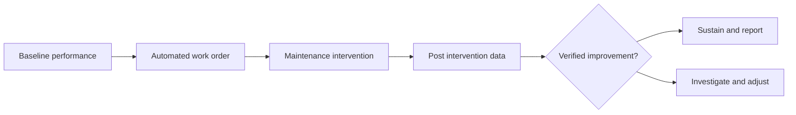

---
aliases:
  - Measurement and Verification
  - M&V
date_created: 2026-10-06
date_modified: 2026-10-07
image_prompt: A compass, a barometer, a leveler, a thermometer, and other measuring devices are on a table in front of a school building. Robots representing AI Agents are rummaging through, playing with them.
banner_image: https://ik.imagekit.io/xvpgfijuw/Image-Gin/2026-10/Measurement_and_Verification_banner_image_1791326162760_wu8tN4Vmh.webp
portrait_image: https://ik.imagekit.io/xvpgfijuw/Image-Gin/2026-10/Measurement_and_Verification_portrait_image_1791326163691_D6IAIVjai.webp
square_image: https://ik.imagekit.io/xvpgfijuw/Image-Gin/2026-10/Measurement_and_Verification_square_image_1791326164134_lnu2r0mE9.webp
banner_image_taller: https://ik.imagekit.io/xvpgfijuw/Image-Gin/2026-10/Measurement_and_Verification_banner_image_taller_1791326164546_4QseygyUT.webp
cf_last_run: 2026-10-06T22:37:48.121Z
cf_last_run_model: Perplexity sonar-pro
---

[[Work Order Automations]]
[[Facilities Management Software]]
[[content-areas/AI-Factories-Datacenters/Concepts/Building Automation and Control Systems|Building Automation and Control Systems]]
[[content-areas/AI-Factories-Datacenters/Concepts/Smart Buildings]]

# Defining and Describing Measurement and Verification in Work Order Automation

_Measurement and verification turns automated work orders from logged activity into demonstrated operational results._

In work order automation, **measurement and verification (M&V)** is a structured method for establishing a baseline, tracking post-intervention performance, and determining whether an automated maintenance action produced its intended result. The underlying M&V principle is to compare actual post-intervention performance with an adjusted estimate of what would have occurred without the intervention. [^yxvo9u] [^nru6rh] Applied to work orders, the method can evaluate outcomes such as response time, completion time, repeat failures, asset availability, energy use, maintenance cost, and compliance—not merely whether a ticket was closed.

A work-order M&V program therefore connects automation events—such as condition alerts, automatic assignment, escalation, parts requests, and closure—with independent operational evidence. This distinction matters because a completed work order is an activity measure, whereas verified improvement is an outcome measure.

# Uses in Context

- **Performance accountability:** M&V is invoked to determine whether a maintenance program delivered the result it promised, rather than treating work-order completion as proof of success. In established M&V practice, savings or improvement are determined from measured data and comparison with an adjusted baseline. [^yxvo9u] [^nru6rh]

- **Operational benchmarking:** Facilities teams use the concept to compare pre-automation and post-automation indicators, including asset downtime, labor utilization, response time, and backlog. The comparison follows the broader M&V logic of defining a baseline period and a reporting period. [^nru6rh] [^shyc24]

- **Automated alert validation:** M&V can test whether sensor-generated or rule-generated work orders correspond to real asset conditions and whether intervention reduced the targeted failure mode. This extends the baseline-and-reporting-period model from energy consumption to maintenance outcomes. [^nru6rh] [^w2c9ui]

- **Contract and service verification:** Owners can use M&V to substantiate performance-based maintenance or energy-service claims by documenting the intervention, operating conditions, measured results, and adjustments. IPMVP is described as a framework for measuring and reporting energy, demand, water, and related cost savings. [^g1aw0q] [^506ok4]

- **Continuous improvement:** Instead of calculating results only at project completion, ongoing monitoring compares performance with the baseline over time, allowing teams to detect deterioration or persistence problems. [^m6lb88]

# History of Use

## Origins

The exact combined phrase **“Measurement and Verification in Work Order Automation”** does not appear in the supplied search results as a separately established historical term. It is best understood as a synthesis of two established practices: M&V from energy-performance engineering and automated work-order management from computerized maintenance and facilities operations.

- The formal M&V tradition is associated with the **[[International Performance Measurement and Verification Protocol]] (IPMVP)**, described as a global best-practice framework developed and maintained by the Efficiency Valuation Organization. [^g1aw0q]

- The central methodological problem is counterfactual: savings or improvement cannot be directly observed when they represent consumption or failures that did not occur. Instead, practitioners estimate the baseline and compare it with measured performance under comparable conditions. [^yxvo9u] [^wpq8f4] [^u6on9s]

- The resulting structure—baseline, intervention, reporting period, adjustment, and verified result—provides the conceptual foundation for applying M&V to automated work orders. [^nru6rh] [^w2c9ui]

## Evolution

- **1990s–2000s — Protocol-based performance claims:** IPMVP established a common vocabulary and methodology for defining baselines, measurement boundaries, adjustments, and reporting of energy and cost savings. [^g1aw0q] [^escrf8]

- **2010s — Digital and model-based verification:** M&V increasingly used interval data, regression models, weather variables, occupancy, production, and operating hours to estimate adjusted baselines rather than relying only on simple before-and-after comparisons. [^shyc24] [^wpq8f4] [^506ok4]

- **2020s — Continuous operational verification:** Digital platforms began positioning M&V as an ongoing process, tracking performance against baseline conditions day by day or month by month instead of calculating savings only once. [^m6lb88] In work-order automation, this supports closed-loop validation of whether automated maintenance decisions improve asset and service outcomes.

# Best Real-World Examples

- [IPMVP](https://www.evo-world.org/) — a protocol framework for measuring and verifying energy, demand, water, and related cost savings through baseline comparison and documented adjustments. [^g1aw0q] [^506ok4]

- [EVO](https://www.evo-world.org/) — the organization identified in the search results as maintaining the IPMVP framework for credible performance measurement. [^g1aw0q]

- [Spacewell Energy](https://spacewell.com/resources/turning-efficiency-into-evidence/) — an example of continuous baseline tracking that compares ongoing performance rather than treating verification as a one-time calculation. [^m6lb88]

- [CIM](https://www.cim.io/blog/measurement-and-verification-energy-savings-ipmvp) — an example of explaining M&V through baseline energy, reporting-period energy, and routine or non-routine adjustments. [^nru6rh]

- [Enerlogix](https://enerlogix.org/en/blog/medicion-verificacion-ahorros-ipmvp) — an example of presenting M&V as measured demonstration that an efficiency project reduced consumption by the promised magnitude. [^yxvo9u]

- [Pilot Energy](https://pilotenergy.com/outlet/topics/measurement-verification) — an example of regression-based M&V using weather, production, and occupancy drivers to calculate an adjusted baseline. [^wpq8f4]

# Case Studies

**Continuous baseline verification.** Spacewell Energy describes an approach in which performance is tracked against a baseline “day by day, month by month,” rather than calculating savings only at project completion. [^m6lb88] Applied to work-order automation, the same pattern would compare asset or service KPIs continuously: for example, whether automated corrective actions reduce repeat failures, downtime, or response intervals over successive reporting periods. The case demonstrates that M&V is most useful when verification remains active after implementation, because performance can degrade even when the automation continues generating and closing work orders.

**Regression-adjusted operational measurement.** Pilot Energy describes sophisticated M&V as modeling pre-intervention energy use against drivers such as heating and cooling degree days, production volume, and occupancy hours, then applying current-period conditions to calculate an adjusted baseline. [^wpq8f4] A work-order automation program can use an analogous design by controlling for workload volume, operating hours, asset criticality, seasonality, staffing, and production intensity before comparing outcomes. This shows why a simple before-and-after comparison can be misleading: a shorter average completion time may result from lower workload, while a higher failure rate may reflect heavier production rather than poor automation.

**Protocol-based verification of promised results.** IPMVP-based practice defines a baseline period, measures the reporting period, and adjusts for conditions that changed between them. [^nru6rh] [^g1aw0q] In an automated maintenance deployment, the equivalent evidence package would document the pre-automation backlog, response and completion distributions, failure history, intervention date, automation rules, exceptions, and post-deployment results. The case illustrates the difference between **automation evidence**—that a rule fired or a ticket closed—and **performance evidence**—that the targeted operational condition improved relative to a defensible counterfactual.

***

# Sources

[^yxvo9u]: [enerlogix.org › en › blogMeasurement and Verification of Savings (IPMVP)](https://enerlogix.org/en/blog/medicion-verificacion-ahorros-ipmvp)
[^nru6rh]: [Measurement and Verification (M&V) of Energy Savings](https://www.cim.io/blog/measurement-and-verification-energy-savings-ipmvp)
[^shyc24]: [Measurement and Verification (M&V): IPMVP services - Certimac](https://certimac.it/en/academy/glossary/measurement-and-verification-mv)
[^g1aw0q]: [Measurement & Verification (M&V) Guide](https://eevs.co.uk/measurement-verification-guide)
[^wpq8f4]: [The Four Ipmvp Options](https://pilotenergy.com/outlet/topics/measurement-verification)
[^w2c9ui]: [www.captiatechnology.com › en › resourcesIndustrial Energy Efficiency: ISO 50001 and IPMVP Measurement ...](https://www.captiatechnology.com/en/resources/energy/eficiencia-iso-50001/)
[7]: [M - V GRFN | PDF](https://www.scribd.com/document/969015354/M-V-GRFN)
[8]: [Commissioning for Energy Efficiency: Measurement and Verification …](https://hvacprosales.com/hvac-commissioning/measurement-verification/)
[^u6on9s]: [#energyefficiency #ipmvp #sustainability #energymanagement ...](https://www.linkedin.com/posts/jeroenoudenaarden_energyefficiency-ipmvp-sustainability-activity-7422303173958352897-N7hZ)
[^escrf8]: [Evo | PDF](https://www.scribd.com/document/968976502/Evo)
[11]: [Measurement and Verification in Energy Projects | PDF - Scribd](https://www.scribd.com/document/982009114/Measurement-and-Verification)
[^m6lb88]: [Turning Efficiency Into Evidence - Spacewell](https://spacewell.com/resources/turning-efficiency-into-evidence/)
[^506ok4]: [HVAC Measurement and Verification: IPMVP Protocol Guide](https://hvacprosales.com/hvac-energy-auditing/measurement-verification/)
[14]: [HVAC Energy Benchmarking and Measurement & Verification](https://oxmaint.com/industries/hvac/hvac-energy-benchmarking-measurement-verification)
[15]: [How To Use Utility Bills for M&V - EnergyCAP](https://www.energycap.com/blog/how-to-use-utility-bills-for-mv/)
