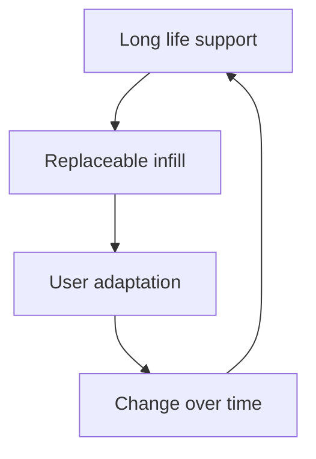

# Defining and Describing Open Building Protocols

 

- _Open Building Protocols treat buildings as changeable systems rather than finished, fixed objects._
- In architectural theory, **Open Building** separates long-life collective infrastructure—often called the **support**—from shorter-life, user-controlled **infill** such as partitions, finishes, equipment, and services. [^x18adu] The approach originated as a response to the rigidity of treating an entire building as one indivisible design solution. [^bq49bw]
- In contemporary practice, the phrase **Open Building Protocols** can also describe rules, interfaces, data standards, and governance arrangements that let different building components, suppliers, users, and software systems interoperate without proprietary lock-in. [^8kd2nb] [^guap26] [^c8iic0]
- The concept applies across the building life cycle: initial design, construction, occupation, renovation, maintenance, adaptive reuse, and eventual component replacement. [^11f2iy] [^c8iic0]

# Uses in Context

- **Housing and architecture:** “Open Building” describes housing in which a durable structural and service framework allows residents or later designers to modify interiors over time. [^x18adu]
- **Healthcare design:** The framework separates a hospital’s “base building,” tenant fit-out, and furnishings, fixtures, and equipment so specialized units can change with limited disruption to other systems. [^bq49bw]
- **Incremental housing:** Elemental’s projects use serviced, partially completed structures that residents can expand, presenting a practical form of open-building logic under financial and regulatory constraints. [^f8o6nm]
- **Building automation:** Open protocols connect systems such as HVAC, lighting, access control, and energy metering across vendors through common interfaces and data models. [^8kd2nb] [^guap26]
- **Digital construction:** openBIM uses vendor-independent formats to exchange building information among technologies, disciplines, and organizations throughout a project’s life cycle. [^c8iic0]
- **Sustainability and circularity:** Separating long- and short-life components can support repair, replacement, material reuse, and reduced dependence on whole-building demolition. [^x18adu]

# History of Use

## Origins

- The intellectual origin is generally attributed to Dutch architect and theorist **N. John Habraken**, whose 1961 book *Supports: An Alternative to Mass Housing* articulated a distinction between a collective structural support and individually controlled dwelling infill. [^bq49bw] [^x18adu]
- Habraken’s proposal challenged mass housing’s assumption that a single authority should determine the complete form of every dwelling; instead, it gave inhabitants a continuing role in shaping their living environments. [^x18adu]
- The original architectural concept predates the newer software and building-automation usage of “open protocols.” In the latter context, openness means documented, vendor-neutral communication and data exchange rather than only physical adaptability. [^8kd2nb] [^guap26] [^c8iic0]

## Evolution

- **1961 — Support and infill:** Habraken introduced Open Building as an alternative to mass housing, distinguishing the long-lived collective support from changeable individual dwelling components. [^bq49bw] [^x18adu]
- **Late twentieth and early twenty-first centuries — Institutional and healthcare adaptation:** Open-building theory was applied to complex facilities where spatial arrangements, technologies, and operational requirements change over time; the Sammy Ofer Heart Building case documents modifications driven by medical technology, healthcare norms, and policy changes. [^bq49bw]
- **2020s — Protocol and data-layer expansion:** The idea increasingly overlaps with openBIM, semantic building models, interoperable building-management systems, and community-governed software that connect heterogeneous systems without proprietary lock-in. [^8kd2nb] [^guap26] [^c8iic0]

# Best Real-World Examples

- [Elemental’s Quinta Monroy](https://www.elementalchile.cl/en/projects/quinta-monroy/), an incremental-housing project in Iquique that delivered serviced structures designed for resident-led expansion. [^f8o6nm]
- [Elemental’s Constitución housing](https://www.elementalchile.cl/en/projects/villa-verde/), where “half-a-house” units supplied essential kitchens, bathrooms, roofs, and load-bearing walls while leaving room for later additions. [^f8o6nm]
- [Aranya Community Housing](https://www.archnet.org/sites/1942), a housing precedent associated with incremental and participatory adaptation. [^f8o6nm]
- [Sammy Ofer Heart Building](https://www.tau.ac.il/), a hospital project documented as separating system levels so changes in one level had minimal impact on others. [^bq49bw]
- [OpenBMS](https://www.openbms.io/), a community-driven, vendor-neutral building-management system connecting BACnet, MQTT, and other building and IoT protocols. [^8kd2nb]
- [openBIM](https://www.buildingsmart.org/standards/bsi-standards/), an initiative maintained by buildingSMART International that promotes vendor-independent building-data exchange. [^c8iic0]
- [BRICK Schema](https://brickschema.org/), a semantic modeling approach identified among community-governed standards for integrating heterogeneous smart-building systems. [^guap26]

# Case Studies

**Elemental’s Quinta Monroy, Iquique.** In Quinta Monroy, Chile, Elemental worked within tight housing-subsidy constraints and delivered partially finished, serviced structures rather than conventional turnkey homes. [^f8o6nm] The project provided a durable core while deliberately leaving residents the ability to extend and customize their homes. [^f8o6nm] This operationalized Open Building principles through incremental construction: the initial intervention established essential infrastructure, while later occupants supplied additional space and finishes as their resources and needs changed. [^f8o6nm] The case shows that openness can be a social and economic strategy, not merely a technical one: the building is designed to accommodate future agency rather than treating the first construction phase as final.

**Sammy Ofer Heart Building, Tel Aviv.** The Sammy Ofer Heart Building at Tel Aviv Sourasky Medical Center was designed by Sharon Architects and Ranni Ziss Architects and constructed between 2008 and 2011. [^bq49bw] Its organization applied open-building theory by separating the primary building system, tenant or departmental fit-out, and furnishings, fixtures, and equipment. [^bq49bw] Over the following decade, the spatial environment changed in response to specialized medical units, advances in medical technology, changing healthcare norms, and adaptive policy standards. [^bq49bw] The project demonstrates why protocol-like separation matters in complex buildings: changes at one system level can occur with less disruption to other levels. [^bq49bw]

**OpenBMS and interoperable building control.** OpenBMS presents a contemporary software interpretation of openness as a community-driven, vendor-neutral building-management system. [^8kd2nb] Its stated architecture connects [[BACnet]], [[Sources/Standards-and-Specs/MQTT]], and modern IoT protocols while aligning with emerging ASHRAE standards. [^8kd2nb] More broadly, interoperable smart-building platforms use standardized APIs, protocol adapters, and semantic layers to combine HVAC, lighting, access control, energy metering, and other subsystems from different suppliers. [^guap26] This shifts Open Building Protocols from a primarily architectural theory into an operational technology practice: openness is expressed through documented interfaces, shared data models, and the ability to replace or combine components without being locked into one vendor. [^8kd2nb] [^guap26]

***

# Sources

[^f8o6nm]: [Designing for Change: Performative and Flexible ...](https://www.frontiersin.org/journals/built-environment/articles/10.3389/fbuil.2025.1677525/abstract)
[2]: [Paper 4 Next 21 by Habraken | PDF](https://www.scribd.com/document/975494752/Paper-4-Next-21-by-Habraken)
[^11f2iy]: [Full article: Adaptable buildings: review and recommendations ...](https://www.tandfonline.com/doi/full/10.1080/17452007.2026.2701469)
[4]: [(PDF) Building Dynamics - Academia.edu](https://www.academia.edu/69434740/Building_Dynamics)
[^8kd2nb]: [openbms.io](https://www.openbms.io/)
[^guap26]: [Open-Source Interoperable Smart Building Platform Market ...](https://marketintelo.com/report/open-source-interoperable-smart-building-platform-market)
[^bq49bw]: [O-0631](https://www.scribd.com/document/494770061/O-0631)
[8]: [news.bimcad.org · case-studies · bim-powered-adaptive-reuse-7BIM-Powered Adaptive Reuse: 7 Leading Architecture Firms...](https://news.bimcad.org/case-studies/bim-powered-adaptive-reuse-7-leading-architecture-firms-transforming-renovation/)
[9]: [www.cky.com.tw · en · insightsMCP Protocol for Smart HVAC — Breaking Vendor Lock-In](https://www.cky.com.tw/en/insights/mcp-open-protocol-hvac)
[10]: [Open Source Smart Building Platform & 7D BIM | CONTEXUS](https://contexus.io/)
[^c8iic0]: [Exploring openBIM Data Formats Aligned with ISO 19650-4 in ...](https://www.intechopen.com/chapters/1235263)
[12]: [Building ecologies: practicing care, adaptation and repair in architecture through continuous construction](https://www.tandfonline.com/doi/full/10.1080/13602365.2026.2622605)
[^x18adu]: [Open Building → Term](https://lifestyle.sustainability-directory.com/term/open-building/)
[14]: [buildingSMART Explained: openBIM, IFC & IFC5 | VFA - Vitalify Asia](https://www.vitalify.asia/en/blog/what-is-buildingsmart-openbim-ifc)
[15]: [Designed to Evolve: Adaptive Reuse and the Architecture ...](https://www.som.com/story/adaptive-reuse-90-years/)
