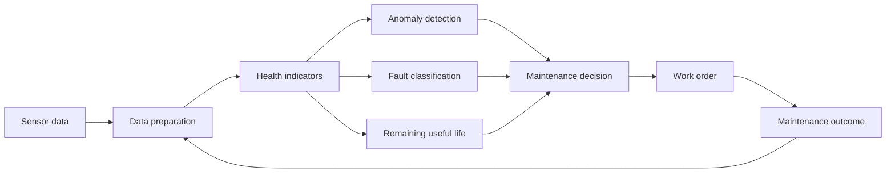

[[Physical AI]]
[[concepts/Market-Categories/Building Management Systems|Building Management Systems]]
[[content-areas/AI-Factories-Datacenters/Concepts/Building Energy Management Systems|Building Energy Management Systems]]
[[content-areas/AI-Factories-Datacenters/Concepts/Integrated Electrical and Mechanical Systems|Integrated Electrical and Mechanical Systems]]

# Defining and Describing Predictive-Maintenance Models

 

_Predictive-maintenance models turn machine data into an early warning about failure, allowing maintenance to happen before a breakdown._

Predictive-maintenance models analyze sensor signals, operating conditions, maintenance records, and historical failure data to detect degradation, classify faults, estimate remaining useful life (RUL), or forecast failure probability. [^c16s54] [^i8js3j] They apply when equipment is instrumented and failure patterns can be observed over time; their purpose is to replace fixed schedules or emergency repairs with condition-informed intervention. [^c16s54] [^haeps9] Typical methods include statistical models, classical machine learning, deep learning, anomaly detection, and hybrid physics-plus-data approaches. [^i8js3j] [^z3kngw] [^4nwq83]

## Uses in Context

- In [[industrial operations]], “predictive maintenance” describes monitoring machine condition and scheduling repairs before a costly breakdown. [^i8js3j] [^dk1osk]
- In manufacturing, models estimate **remaining useful life**, meaning the expected operating duration between the present condition and functional failure. [^c16s54] [^b564sy]
- In condition monitoring, anomaly-detection systems identify deviations from normal behavior using signals such as vibration, temperature, sound, current, pressure, and velocity. [^xr50nb] [^m4t44j]
- In maintenance software, model outputs can be connected to computerized maintenance-management systems so alerts become prioritized work orders. [^ags7gt]
- In aerospace and fleet settings, predictive-maintenance models combine sensor data, physics-based methods, and machine learning to anticipate failures in engines, bearings, vehicles, and other assets. [^a2dgx6] [^4nwq83]
- In discussions of digital twins, predictive maintenance refers to using a digital representation or “digital shadow” of equipment to track degradation and forecast intervention needs. [^31sp9g]

## History of Use

### Origins

- Predictive maintenance developed from **condition-based maintenance**, whose central idea is to determine equipment condition and use degradation from normal behavior to decide when maintenance is needed. [^31sp9g]
- The modern research vocabulary became strongly associated with **prognostics and health management**, especially the prediction of RUL: the number of cycles or operating units remaining before a component becomes nonfunctional. [^c16s54]
- [[organizations/National Aeronautics and Space Administration]] and university-linked maintenance datasets helped establish a common experimental basis for the field, including the **NASA C-MAPSS turbofan degradation dataset** and bearing datasets used to test failure prediction and RUL algorithms. [^i8js3j] [^31sp9g]
- The innovation was therefore distributed across reliability engineering, academic prognostics research, industrial sensor systems, and open research datasets rather than originating with a single technology company. [^i8js3j] [^31sp9g] [^4nwq83]

### Evolution

- **1990s–2000s — Condition monitoring to prognostics:** Maintenance research expanded from detecting abnormal condition to estimating degradation trajectories and RUL, enabling intervention before failure rather than merely diagnosing a fault after it appeared. [^c16s54] [^31sp9g]
- **2010s — Machine learning and benchmark datasets:** Supervised learning, anomaly detection, and recurrent neural networks were increasingly applied to sensor time series, while NASA and bearing datasets made comparisons between methods easier. [^i8js3j] [^z3kngw]
- **2020s — Hybrid, connected, and operational systems:** Current systems combine IoT sensors, deep learning, physics-based reasoning, digital twins, edge or cloud deployment, and CMMS integration; major unresolved issues include preprocessing, alert thresholds, data quality, and cross-domain generalization. [^i8js3j] [^m4t44j] [^ags7gt]

## Best Real-World Examples

- [NASA C-MAPSS turbofan dataset](https://ti.arc.nasa.gov/tech/dash/groups/pcoe/prognostic-data-repository/) — a benchmark for estimating aircraft-engine degradation and RUL. [^i8js3j] [^a2dgx6]
- [NASA bearing dataset](https://ti.arc.nasa.gov/tech/dash/groups/pcoe/prognostic-data-repository/) — used to predict bearing degradation and failure dates with methods including autoencoders. [^31sp9g] [^4nwq83]
- [CWRU bearing data](https://engineering.case.edu/bearingdatacenter) — a widely used benchmark for bearing fault classification and predictive-maintenance research. [^i8js3j]
- [SAPPHOS](https://ncms.org/news/technology-brief/enhancing-predictive-maintenance-technologies-for-vehicles-and-other-fleet-assets/) — a vehicle and fleet-maintenance initiative combining physics-based techniques, classical AI, machine learning, and numerical methods. [^4nwq83]
- [i40pilot predictive-maintenance system](https://i40pilot.app/solutions/predictive-maintenance-ai-reducing-downtime-case-study) — a documented industrial workflow using historical maintenance logs with gradient-boosted and LSTM models. [^dk1osk]
- [InTechHouse predictive-maintenance deployment](https://intechhouse.com/blog/predictive-maintenance-with-machine-learning-models-training-and-deployment) — an example of unsupervised anomaly detection connected to a client’s CMMS and validated with temporal splits. [^ags7gt]
- [AI-driven rotating-equipment platform](https://www.infinitytechnologies.pro/stories/ai-driven-predictive-maintenance-for-rotating-equipment) — a production deployment using SCADA integration, autoencoders, and gradient boosting. [^t1u4z3]

## Case Studies

NASA’s turbofan and bearing datasets became influential testbeds because they provide degradation trajectories that can be used to evaluate whether a model detects deterioration and estimates RUL before failure. [^i8js3j] [^31sp9g] [^a2dgx6] Researchers have applied preprocessing, normalization, time-series segmentation, regression, recurrent networks, autoencoders, and hybrid approaches to these datasets. [^z3kngw] [^a2dgx6] [^4nwq83] The case demonstrates that predictive-maintenance research depends not only on model architecture but also on standardized data, meaningful health indicators, and evaluation against the timing of failure. [^i8js3j] [^z3kngw]

In one documented manufacturing-oriented deployment, i40pilot combined a historical operating baseline with two years of maintenance records and trained gradient-boosted and LSTM-based models to detect early degradation. [^dk1osk] The example illustrates the move from laboratory prediction to operational decision support: the model is valuable only when its alerts can be interpreted, validated against maintenance history, and translated into an intervention before failure. [^dk1osk]

A separate implementation described by InTechHouse trained an unsupervised anomaly-detection model on eighteen months of vibration and temperature data, used a temporal train–test split to avoid leaking future information into evaluation, and tuned alert thresholds with maintenance personnel. [^ags7gt] The resulting daily scoring pipeline sent flagged assets to the client’s CMMS as prioritized work orders. [^ags7gt] This case shows that deployment architecture, threshold design, human expertise, and workflow integration are as important as predictive accuracy; it also highlights the operational risk of alert fatigue and false positives. [^ags7gt]

***

# Sources

[^c16s54]: [Remaining Useful Life (RUL) Prediction Methods for Machine ...](https://onlinelibrary.wiley.com/doi/10.1002/eng2.70699)
[^i8js3j]: [ARTIFICIAL INTELLIGENCE AND ROBOTICS IN PREDICTIVE ...](https://www.frontiersin.org/journals/mechanical-engineering/articles/10.3389/fmech.2025.1722114/abstract)
[^haeps9]: [Remaining Useful Life (RUL) Prediction Methods for Machine Health ...](https://onlinelibrary.wiley.com/doi/full/10.1002/eng2.70699)
[^xr50nb]: [Predictive maintenance - Machine Learning](https://www.scribd.com/document/990223713/Predictive-maintenance)
[^dk1osk]: [i40pilot.app · solutions · predictive-maintenance-aiPredictive Maintenance with AI: Downtime Reduction Case Study](https://i40pilot.app/solutions/predictive-maintenance-ai-reducing-downtime-case-study)
[^z3kngw]: [A Systematic Review of Anomaly and Fault Detection Using Machine Learning for Industrial Machinery](https://www.mdpi.com/1999-4893/19/2/108)
[^m4t44j]: [AI algorithms and IoT platforms for anomaly and failure prediction in ...](https://www.frontiersin.org/journals/artificial-intelligence/articles/10.3389/frai.2026.1799522/full)
[^31sp9g]: [Digital Twin for Predictive Maintenance: A Systematic Review (IST ...](https://www.studocu.com/in/document/indian-institute-of-management-lucknow/strategic-management/digital-twin-for-predictive-maintenance-a-systematic-review-ist-151/145129546)
[9]: [www.aiventic.ai › blog › ai-predictive-maintenanceAI Predictive Maintenance: Case Studies in Oil & Gas](https://www.aiventic.ai/blog/ai-predictive-maintenance-case-studies-oil-and-gas)
[10]: [AI Predictive Maintenance: A Practical Guide for Manufacturing](https://blog.meetneura.ai/ai-predictive-maintenance/)
[^a2dgx6]: [link.springer.com › article › 10Predictive maintenance for aircraft cost reduction using ...](https://link.springer.com/article/10.1007/s44465-026-00024-1?error=cookies_not_supported&code=afcfe062-a7a6-4b83-a006-4cb3ff496018)
[^ags7gt]: [Predictive Maintenance with Machine Learning: Models, Training ...](https://intechhouse.com/blog/predictive-maintenance-with-machine-learning-models-training-and-deployment)
[^t1u4z3]: [AI-Driven Predictive Maintenance for Rotating Equipment](https://www.infinitytechnologies.pro/stories/ai-driven-predictive-maintenance-for-rotating-equipment)
[^4nwq83]: [Enhancing Predictive Maintenance Technologies for Vehicles and ...](https://ncms.org/news/technology-brief/enhancing-predictive-maintenance-technologies-for-vehicles-and-other-fleet-assets/)
[^b564sy]: [Predictive maintenance in industrial systems: an XGBoost ...](https://www.tandfonline.com/doi/abs/10.1080/21681015.2025.2519369)
