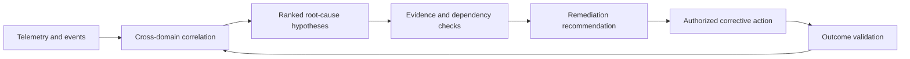

## Retrieved sources

The supplied retrieved sources describe other entities—Arch Systems, Groundup.ai, IndustrialMind.ai, Beamup, CLARC AI, and Quintess AI—not the exact entity **Root-Cause Analysis in Agentic DCIMs**. 

# Value Proposition & Features

The available results describe agentic root-cause analysis as an investigation process that separates an initiating failure from correlated symptoms and downstream effects. Elastic’s example recommends scoping the incident, enumerating candidate causes, testing or refuting them, and attaching traceable evidence to findings. [^1fqv1d]

Potentially relevant capabilities described in the search results include:

- Multi-agent investigation across logs, metrics, traces, service dependencies, and deployment history. [^pt5ft3]
- Iterative observe–hypothesize–test–narrow–rank workflows. [^rzom97]
- Parallel hypothesis management and verifier agents. [^rzom97]
- Evidence traceability using stable artifact identifiers, trace IDs, and document IDs. [^c4b900] [^1fqv1d]
- Confidence scoring and explicit human approval before remediation. [^rzom97] [^2g32gg]

These capabilities are characteristics of the broader category, not verified features of the exact entity requested.

# Market Sizing

## Category, Market Size, and Category Growth

The exact entity cannot be reliably placed in a market category from the available evidence. The surrounding field appears to include **agentic incident response**, **AI observability**, **industrial diagnostics**, and **data-center infrastructure management**, but no credible market-size or growth estimate specific to this entity was found.

## Who it's for, who it's not for

If the page refers to an agentic DCIM root-cause-analysis tool, its likely users would be data-center operators, infrastructure engineers, and incident-response teams investigating failures across interconnected systems. This interpretation is based on category-level descriptions of agents analyzing service topology, telemetry, incident timelines, and deployment history. [^rzom97] [^t72joq]

It would not be appropriate to treat unrelated industrial-maintenance or manufacturing-intelligence companies as confirmed competitors without evidence that the exact entity serves the same market.

## Viable Alternatives

- **Elastic Agent Builder** — provides an example workflow for AI-assisted RCA using scoped queries, candidate enumeration, refutation, and evidence citations. [^1fqv1d]
- **NeuBird** — describes multi-service RCA that follows dependencies from an affected service toward an underlying degraded dependency. [^t72joq]
- **Struct AI agentic on-call** — describes an agentic incident workflow using observability data, service topology, parallel hypotheses, and human escalation gates. [^rzom97]
- **TRACE** — a research system for evidence-grounded agentic RCA with recursive investigation and confidence evaluation. [^c4b900]

## Competitor Table

| Competitor | Description |
|---|---|
| [Elastic Agent Builder](https://www.elastic.co/observability-labs/blog/ai-root-cause-analysis-agent-builder) | AI-assisted RCA workflow emphasizing explicit scope, candidate testing, and traceable evidence. [^1fqv1d] |
| [NeuBird](https://neubird.ai/resources/multi-service-root-cause-analysis) | Multi-service RCA approach that follows dependency chains to locate underlying degradation. [^t72joq] |
| [Struct AI](https://struct.ai/articles/agentic-on-call-root-cause/) | Agentic on-call RCA architecture using telemetry, parallel hypotheses, verification, and human approval gates. [^rzom97] |
| [TRACE](https://www.amazon.science/publications/trace-traceable-root-cause-analysis-with-calibrated-evidence-grounded-agents) | Evidence-grounded research system combining supervised investigation, recursive why-drilling, and confidence checks. [^c4b900] |

# Defining and Describing Root-Cause Analysis in Agentic DCIMs

- _Root-cause analysis in an agentic [[concepts/Market-Categories/Data Center Infrastructure Management Systems|DCIM]] turns scattered infrastructure signals into a tested explanation—and, when authorized, a corrective action._
- Root-cause analysis (RCA) is the structured process of identifying the underlying cause of an incident rather than merely treating its visible symptom. [^zq9uvu] In an agentic data-center infrastructure-management (DCIM) system, the process extends across servers, storage, networks, power systems, cooling, batteries, and building-management systems. [^0tjhut]
- Agentic systems add autonomous reasoning and action: they can correlate telemetry, operational context, historical knowledge, and dependencies; form hypotheses; recommend remediation; and, in some implementations, execute corrective actions. [^0tjhut] [^2fix4d] [^l2uv47]
- The concept matters because data-center failures are cross-domain: a service degradation may originate in a configuration change, network path, power event, thermal condition, or dependency outside the component that first generated an alert. [^0tjhut] [^0h6zgq]

## Uses in Context

- **Incident response:** RCA is invoked to distinguish the primary cause of an outage from correlated symptoms and to prevent recurrence. [^zq9uvu] [^6b9z2x]
- **AIOps:** Platforms combine topology, event timing, metrics, logs, configuration, service dependencies, and historical incidents to produce a ranked set of likely causes. [^0h6zgq] [^3nsy6e]
- **Data-center facilities operations:** Agentic systems connect detected events with institutional knowledge, previous actions, and unstructured context to automate RCA and generate work orders. [^2fix4d]
- **Predictive operations:** Cross-layer analysis is used to identify likely causes before operators lose time comparing separate monitoring tools. [^ze2tly]
- **Autonomous remediation:** Advanced agents are described as able to “hypothesize, test, correlate, and self-correct” across multiple operational domains. [^l2uv47]
- **Management and quality improvement:** Traditional RCA frames failures as opportunities to correct systemic process weaknesses rather than assign blame to an individual. [^zq9uvu] [^clex42]

## History of Use

### Origins

- RCA did not emerge from one single academic discipline; it developed from overlapping traditions in engineering, quality control, management science, occupational safety, and industrial manufacturing during the mid-to-late twentieth century. [^clex42]
- Kaoru Ishikawa developed the cause-and-effect, or fishbone, diagram in the 1960s as a structured way to brainstorm and categorize possible causes of an observed effect. [^fy0g7r] [^clex42]
- The “Five Whys” method is associated with Sakichi Toyoda and was later embedded in the Toyota Production System; Taiichi Ohno helped codify the method and its production-system context. [^fy0g7r] [^zq9uvu]
- W. Edwards Deming and Joseph M. Juran helped popularize statistical and systemic approaches that emphasized correcting process variation and management-system weaknesses rather than focusing only on individual error. [^zq9uvu] [^clex42]

### Evolution

- **1960s — Visual causal analysis:** Ishikawa’s fishbone diagram gave quality teams a repeatable visual structure for organizing possible causes of defects and failures. [^fy0g7r] [^clex42]
- **Mid-to-late twentieth century — Industrial and safety formalization:** RCA expanded alongside postwar industrial growth, standardized quality control, accident investigation, reliability engineering, and workplace-safety practices. [^clex42]
- **2010s–2020s — AIOps and agentic operations:** RCA moved from retrospective human investigation toward continuous machine-assisted correlation of metrics, logs, traces, topology, configuration, and historical incidents; newer agentic systems add hypothesis testing, remediation planning, and autonomous execution. [^0h6zgq] [^l2uv47] [^3nsy6e]

## Best Real-World Examples

- [Five Whys](https://www.clickhouse.com/resources/engineering/root-cause-analysis) — A Toyota Production System method that repeatedly asks why to move from a symptom toward an underlying process cause. [^zq9uvu]
- [Ishikawa Fishbone Diagram](https://www.taproot.com/comparing-root-cause-analysis-techniques/) — A quality-control framework for visually categorizing contributing causes. [^0p8d47]
- [AIOps incident-management engines](https://aiopsschool.com/blog/the-beginner-guide-to-aiops-incident-management-and-modern-observability/) — Systems that correlate event timelines, deployments, configuration changes, and telemetry to prioritize probable causes. [^3nsy6e]
- [Seeq Intelligence](https://www.seeq.com/resources/blog/agentic-ai-for-data-center-facilities-operations/) — An agentic facilities-operations approach that combines detected events, institutional knowledge, prior actions, and unstructured context for RCA and work-order generation. [^2fix4d]
- [Virtana hybrid-cloud observability](https://www.virtana.com/use-case/hybrid-cloud-observability/) — Cross-layer analysis intended to identify likely causes before operators manually compare separate tools. [^ze2tly]
- [Cisco agentic AI operations](https://www.cisco.com/c/en/us/products/collateral/networking/cloud-networking/resolve-dc-issues-faster-agentic-ai-operations-so.html) — A modern adopter example describing agents that actively test and correlate hypotheses across domains. [^l2uv47]
- [Open AIOps practices](https://dev.to/da-li-at-pl/where-aiops-delivers-real-value-in-data-center-operations-1min) — A practitioner-oriented model combining topology, timing, metrics, logs, configuration, dependencies, and incident history. [^0h6zgq]

## Case Studies

Seeq’s data-center facilities-operations example illustrates how RCA becomes an agentic workflow rather than a standalone diagnostic report. Its Intelligence offering is described as connecting detected events with institutional knowledge, prior actions, and unstructured contextual data, then using that context to automate root-cause analysis and generate work orders. [^2fix4d] The example shows that facilities RCA depends not only on sensor values but also on organizational memory: what happened previously, what action was taken, and how the site’s operational context should influence the next step. [^2fix4d]

AIOps incident-management engines represent the transition from isolated alerts to evidence-based causal ranking. These systems review the timeline preceding a failure, correlate anomalies with recent deployments, configuration modifications, or database changes, and present engineers with a prioritized list of probable causes. [^3nsy6e] When confidence is sufficiently high, the incident context can be passed to an automation framework for remediation. [^3nsy6e] This demonstrates the central distinction between ordinary monitoring and agentic RCA: monitoring reports abnormal conditions, while RCA connects conditions into a causal hypothesis and may initiate a controlled response.

Cisco’s agentic-operations example describes a further expansion across data-center domains. Rather than relying only on basic pattern matching, its agents are described as able to “hypothesize, test, correlate, and self-correct” across multiple domains simultaneously. [^l2uv47] Other industry descriptions similarly position agentic infrastructure operations as combining real-time telemetry, anomaly detection, cross-domain correlation, root-cause analysis, and corrective action across compute, storage, networking, power, cooling, and building systems. [^0tjhut] The case illustrates both the promise and the governance requirement of agentic RCA: autonomous action is useful only when the system can connect its diagnosis to evidence, validate the result, and operate within explicitly authorized remediation boundaries.

***

# Sources

[^0tjhut]: [The Billion-Dollar Shift: Why Investors Are Banking on Agentic AI for ...](https://www.linkedin.com/pulse/billion-dollar-shift-why-investors-banking-agentic-ai-sagar-sen-wi5ef)
[2]: [How AI Is Transforming Infrastructure Management at Scale - Finout](https://www.finout.io/blog/how-ai-is-transforming-infrastructure-management-at-scale)
[^2fix4d]: [Agentic AI for Data Center Facilities Operations](https://www.seeq.com/resources/blog/agentic-ai-for-data-center-facilities-operations/)
[4]: [HPE Networking President Rami Rahim On Latest Self-Driving Network Innovation And Why HPE Remains ‘Years Ahead’ Of Competitors](https://www.crn.com/news/networking/2026/hpe-networking-president-rami-rahim-on-latest-self-driving-network-innovation-and-why-hpe-remains-years-ahead-of-competitors)
[^0h6zgq]: [Where AIOps Delivers Real Value in Data Center Operations](https://dev.to/da-li-at-pl/where-aiops-delivers-real-value-in-data-center-operations-1min)
[^fy0g7r]: [Root Cause Analysis | KÜRE Encyclopedia](https://kureansiklopedi.com/en/detay/root-cause-analysis-fd91e)
[^zq9uvu]: [What is root cause analysis? Methods, process, and limits](https://clickhouse.com/resources/engineering/root-cause-analysis)
[^6b9z2x]: [What is Artificial Intelligence for IT Operations (AIOps)?](https://www.articsledge.com/post/artificial-intelligence-for-it-operations-aiops)
[^ze2tly]: [Predictive Optimization For...](https://www.virtana.com/use-case/hybrid-cloud-observability/)
[^l2uv47]: [Resolve Data Center Issues Faster with Agentic AI Operations ...](https://www.cisco.com/c/en/us/products/collateral/networking/cloud-networking/resolve-dc-issues-faster-agentic-ai-operations-so.html)
[11]: [Agentic AI for IT Operations: Autonomous IT | HCLTech US](https://www.hcltech.com/en-us/knowledge-library/agentic-ai-for-it-operations)
[^clex42]: [Root Cause Analysis (RCA): Problem Solving Methods](https://db.arabpsychology.com/root-cause-analysis-2/)
[13]: [AIOps for Data Centers: Using LLMs to Manage AI Infrastructure - Introl](https://introl.com/blog/aiops-data-centers-llm-infrastructure-management-2025)
[^0p8d47]: [Comparing Major Root Cause Analysis Techniques](https://taproot.com/comparing-root-cause-analysis-techniques/)
[^3nsy6e]: [aiopsschool.com › blog › the-beginner-guide-to-aiopsThe Beginner Guide to AIOps Incident Management and Modern ...](https://aiopsschool.com/blog/the-beginner-guide-to-aiops-incident-management-and-modern-observability/)
[^pt5ft3]: [Agentic AI Is Reshaping Semiconductor Design](https://semiwiki.com/eda/chipagents-ai/373561-agentic-ai-is-reshaping-semiconductor-design/)
[^23ax45]: [Preventing Future Conflict: The Root Cause](https://www.gulf-times.com/article/734836/international/preventing-future-conflict-the-root-cause)
[^c4b900]: [Traceable root-cause analysis with calibrated evidence-grounded ...](https://www.amazon.science/publications/trace-traceable-root-cause-analysis-with-calibrated-evidence-grounded-agents)
[^43dk9v]: [AI Incident Response: A Playbook for Agentic Systems - Akto](https://www.akto.io/blog/ai-incident-response-playbook-agentic-systems)
[^rzom97]: [Agentic On-Call RCA: Cut Triage Time from 45 to 5 Min](https://struct.ai/articles/agentic-on-call-root-cause/)
[^t72joq]: [Multi-Service Root Cause Analysis: A Practitioner's Guide - NeuBird](https://neubird.ai/resources/multi-service-root-cause-analysis)
[^7bn7o9]: [Diagnosing RAG Failure Modes: A Multi-Agent LangGraph ...](https://www.c-sharpcorner.com/article/diagnosing-rag-failure-modes-a-multi-agent-langgraph-diagnostician)
[^8nhule]: [root-cause — Command for Claude Code by hamr0](https://agentmods.dev/commands/hamr0/agentic-toolkit/root-cause)
[^998bnn]: [EviRCA: Decoupling Evidence Extraction from Reasoning for Microservice Root-Cause Analysis | Searcharxiv](https://searcharxiv.com/abs/2609.19825)
[^1fqv1d]: [AI root cause analysis with ES|QL tools in Agent Builder](https://www.elastic.co/observability-labs/blog/ai-root-cause-analysis-agent-builder)
[^2g32gg]: [github.com › Mohith2801 › Incident-CommanderGitHub - Mohith2801/Incident-Commander: AI-powered multi ...](https://github.com/Mohith2801/Incident-Commander)
[^12bhrc]: [incident-investigation · GitHub Topics](https://github.com/topics/incident-investigation?o=desc&s=stars)
[^13pokl]: [mingleiw/jev-oncall: Incident triage on TypeSafe Jev — the ... - GitHub](https://github.com/mingleiw/jev-oncall)
[^14rgj7]: [LLM-assisted schematic test-report analysis and root-cause...](https://semiwiki.com/artificial-intelligence/373932-llm-assisted-schematic-test-report-analysis-and-root-cause-investigation/)
[^15me45]: [Build software better, together](https://r00tvps.com/topics/root-cause-analysis)