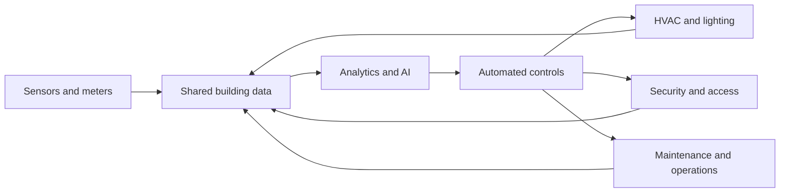

---
aliases:
  - Smart‑building
  - Smart‑buildings
  - smart buildings
date_created: 2026-10-06
date_modified: 2026-10-07
tags: [AI-for-Built-Environment, Building-Automations]
cf_last_run: "2026-10-07T02:08:19.464Z"
cf_last_run_model: "Perplexity sonar-pro"
site_uuid: 210fdae0-45c7-4b68-938f-70be745c316a
publish: true
title: "Smart Buildings"
slug: smart-buildings
at_semantic_version: 0.0.0.1
---

[[content-areas/AI-Factories-Datacenters/Concepts/Building Automation and Control Systems|Building Automation and Control Systems]]
[[content-areas/AI-Factories-Datacenters/Concepts/Building Energy Management Systems|Building Energy Management Systems]]
[[concepts/Sustainability|Sustainability]]

# Defining and Describing Smart Buildings

- _A smart building turns a structure from a passive container into a responsive system that senses conditions, interprets data, and adjusts operations._
- Smart buildings use connected digital technologies to automate building operations that were traditionally performed manually. [^5daqa3] They typically integrate sensors, building-management systems, analytics, and automated controls across heating, ventilation and air conditioning ([[concepts/Market-Categories/Heating, Ventilation, and Air Conditioning|HVAC]]), lighting, security, energy management, and related services. [^wrbhw4] [^8863d0]
- The concept applies most directly to commercial, institutional, industrial, and residential buildings in which operators seek to improve energy efficiency, occupant comfort, safety, maintenance, and operational visibility. [^wrbhw4] [^jh191c]
- A smart building is more than a remotely controlled building: its defining feature is the integration of data from multiple systems so that operations can respond dynamically to occupancy, weather, equipment condition, energy prices, or other changing conditions. [^yrud9w] [^wrbhw4] [^8863d0]

# Uses in Context

- **Energy management:** The term describes systems that combine occupancy, environmental, and energy data to identify waste and adjust HVAC, lighting, and equipment operation. [^wrbhw4] [^ucs5fy]
- **Occupant experience:** Smart-building language is used for spaces that adapt environmental conditions to changing occupancy and user needs, rather than relying solely on fixed schedules. [^lww0xa] [^gre3o0]
- **Facilities management:** Operators use the concept to describe real-time monitoring, fault detection, predictive maintenance, and centralized control of building assets. [^wrbhw4] [^ucs5fy]
- **Sustainability and decarbonization:** Smart-building systems are invoked as tools for reducing energy use, operating costs, and greenhouse-gas emissions. [^yrud9w] [^0wyq7t]
- **Digital transformation:** In technology and property discussions, the term signals the convergence of IoT devices, cloud platforms, digital twins, artificial intelligence, and building-automation systems. [^yrud9w] [^8863d0]
- **Indoor environmental quality:** Smart buildings may use temperature, humidity, carbon-dioxide, particulate-matter, occupancy, and light sensors to manage comfort and air quality. [^wrbhw4]

# History of Use

## Origins

- The modern idea developed from the earlier concept of the **intelligent building**, whose definitions emerged during the 1980s. [^lww0xa] [^gre3o0] One early definition described an intelligent building as “a building which totally controls its own environment.” [^lww0xa]
- United Technology Building Systems Corporation is commonly identified as introducing the intelligent-building concept in 1981, while the City Place Building in Hartford, Connecticut, was recognized in 1983 as an early intelligent-building example. [^gre3o0]
- Early systems emphasized automated environmental control; later definitions expanded toward adaptability, occupant needs, integrated services, and sustainability. [^lww0xa] [^gre3o0]
- The phrase **smart building** became more prominent as connected infrastructure and IoT devices changed how commercial buildings were designed and operated, particularly from the 2000s onward. [^5daqa3]

## Evolution

- **1980s–1990s — From automation to intelligent buildings:** Early approaches focused on centralized control of environmental systems and automated building functions. [^lww0xa] [^gre3o0]
- **2000s — Networked and connected buildings:** The vocabulary shifted toward smart buildings as networked infrastructure and connected devices enabled broader integration among building systems. [^5daqa3]
- **2010s–2020s — Data-driven optimization:** IoT sensors, cloud platforms, AI, and digital twins expanded smart buildings from rule-based automation into adaptive optimization, predictive maintenance, and increasingly autonomous control. [^yrud9w] [^wrbhw4] [^0wyq7t]

# Best Real-World Examples

- [Environmetrics Building](https://www.cmu.edu/) — an early Carnegie Mellon example associated with the development of IoT-oriented smart-building ideas. [^jh191c]
- [City Place Building](https://www.hartford.gov/) — an early intelligent-building example recognized in Hartford, Connecticut, in 1983. [^gre3o0]
- [BrainBox AI](https://brainboxai.com/) — a startup applying AI-based HVAC optimization across a large international building portfolio. [^wrbhw4] [^ggg3x0]
- [Prescriptive Data](https://www.prescriptivedata.io/) — a building-optimization provider associated with sensor-driven operational and energy-management systems. [^ggg3x0]
- [Empire State Building retrofit](https://www.esbnyc.com/) — a large-scale retrofit combining chiller optimization, sensor-equipped windows, tenant energy dashboards, and digital-twin monitoring. [^wrbhw4]
- [Open Building Control](https://www.openbuildingcontrol.org/) — an example of the broader movement toward interoperable, data-connected building automation rather than isolated proprietary systems. [^8863d0]
- [AIoT smart-building systems](https://www.mdpi.com/) — research integrating artificial intelligence with IoT for energy-efficient building operation and adaptive control. [^0wyq7t]

# Case Studies

**BrainBox AI and autonomous HVAC optimization.** BrainBox AI developed an AI overlay for HVAC operations that uses live weather, tariff, and occupancy information to re-optimize building conditions repeatedly. [^yrud9w] A sector review reported that BrainBox AI had applied its systems across more than 1,000 buildings in 25 countries by late 2025 and reported an average HVAC-energy reduction of 25 percent. [^wrbhw4] The example shows how smart-building practice can move beyond fixed schedules and operator dashboards toward continuous, data-driven control. The reported performance is vendor-associated and should therefore be distinguished from independently replicated results. [^wrbhw4]

**Empire State Building retrofit.** The Empire State Building retrofit combined chiller-plant optimization, thousands of insulated window units with embedded sensors, tenant energy-management dashboards, and a digital twin for ongoing performance monitoring. [^wrbhw4] The project illustrates that smart-building outcomes do not depend exclusively on constructing a new “smart” building; substantial intelligence can be added through coordinated retrofit measures in an existing landmark structure. [^wrbhw4] It also demonstrates the importance of integrating physical improvements, sensing, analytics, and occupant-facing information rather than treating automation as a standalone software purchase. [^wrbhw4]

**[[Carnegie Mellon University]]’s Environmetrics Building.** The Environmetrics Building at Carnegie Mellon University is cited as an early example in the development of IoT applications for buildings. [^jh191c] Its significance lies in the research-oriented treatment of the building as an instrumented environment in which sensors, controls, and operational data can support adaptive management. [^jh191c] This case places innovation in an academic and experimental setting rather than attributing the origins of smart buildings to later technology-company platforms.

***

# Sources

[^yrud9w]: [www.coradvisors.net · 2026 · 04Smart Building Technology Companies: An Overview of Leading...](https://www.coradvisors.net/2026/04/smart-building-technology-companies-2026.html)
[^lww0xa]: [O que é Smart Building SASBE-01-2014-0003 - Scribd](https://www.scribd.com/document/997591709/O-que-e-Smart-Building-SASBE-01-2014-0003)
[^5daqa3]: [Was sind intelligente Gebäude? - IBM](https://www.ibm.com/de-de/think/topics/smart-buildings)
[4]: [www.ai-smart-buildings.com · wifi-pir-co2Wi-Fi vs. PIR vs. CO₂](https://www.ai-smart-buildings.com/wifi-pir-co2-occupancy-sensor-comparison/)
[5]: [IoT Data Analytics Case Study: Smart Buildings | PDF - Scribd](https://www.scribd.com/document/712747154/INTERNET-OF-THINGS-AC)
[6]: [Paper+2+ +Volume+2+Issue+1 | PDF | Internet Of Things](https://www.scribd.com/document/989677995/Paper-2-Volume-2-Issue-1)
[^wrbhw4]: [Explainer: Smart buildings and building automation — what they are ...](https://sustainableatlas.org/post/explainer-smart-buildings-and-building-automation-what-they-are-why-they-matter-and-how-to-evaluate-systems-1575)
[^jh191c]: [The Concept of IoT in Smart Buildings](https://green.org/tech/the-concept-of-iot-in-smart-buildings/)
[^ggg3x0]: [The 10 Myths](https://sustainableatlas.org/post/myth-busting-smart-buildings-and-building-automation-10-misconceptions-about-building-automation-and-energy-savings-1579)
[^0wyq7t]: [Integrating IoT and AI for Sustainable Energy-Efficient Smart Building: Potential, Barriers and Strategic Pathways](https://www.mdpi.com/2071-1050/17/22/10313)
[^gre3o0]: [Understanding Intelligent Building Systems | PDF - Scribd](https://ro.scribd.com/document/615628329/Intelligent-Building-System)
[12]: [Case Study IOT | PDF - Scribd](https://www.scribd.com/document/972687471/Case-Study-IOT)
[^8863d0]: [Advancements and Challenges in Smart Building Technology](https://focusnews.uk/research-reports/advancements-and-challenges-in-smart-building-technology-a-comprehensive-analysis/)
[14]: [Occupancy-based controls boost energy efficiency in Canadian ...](https://www.linkedin.com/posts/circuit-lighting_ever-wondered-how-buildings-cut-energy-costs-activity-7448747365638942721-kyu5)
[^ucs5fy]: [Driving Energy Efficiency with IoT](https://www.mrisoftware.com/ae/resources/the-smart-track-to-smart-buildings-driving-energy-efficiency-with-iot/)
