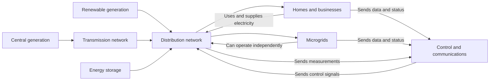

# Defining and Describing Smart Grids

- 

_Smart grids turn the electricity network from a one-way delivery system into a responsive, data-enabled system that can coordinate supply, demand, storage, and distributed generation._ [^sahd8w] [^jfrt4j]

A **smart grid** is an electricity network that combines digital communication, sensors, automation, and real-time data with conventional power infrastructure. [^sahd8w] [^jfrt4j] It supports two-way flows of electricity and information, enabling utilities and customers to respond more precisely to changing demand, system conditions, and renewable generation. [^sahd8w] [^jfrt4j] The concept applies across transmission, distribution, buildings, campuses, industrial sites, neighborhoods, and microgrids. [^rtxl9c] [^jfrt4j] Its importance lies in improving reliability, integrating distributed energy resources, supporting demand response, and allowing local systems to operate independently during disruptions. [^rtxl9c] [^jfrt4j]

# Uses in Context

- **Grid modernization:** “Smart grid” describes the modernization of electricity infrastructure through digital monitoring, communications, automation, and control. [^sahd8w] [^jfrt4j]
- **Demand response:** The term is invoked when consumers or automated systems change electricity use in response to prices or grid conditions, helping reduce peaks and improve reliability. [^69o8y8]
- **Renewable integration:** Smart-grid language commonly describes the coordination of intermittent solar and wind generation with storage, flexible demand, and distributed controls. [^rtxl9c] [^jfrt4j]
- **Microgrids and resilience:** A smart grid may refer to local systems that combine distributed generation, storage, controls, and islanding capability to maintain service during a main-grid outage. [^rtxl9c] [^jfrt4j]
- **Energy management:** In research and engineering, the term encompasses real-time optimization of generation, storage, loads, and electricity flows. [^a4wkbf] [^920zzq]
- **Digital transformation of utilities:** The concept is used to signal a shift from passive infrastructure toward networks that continuously measure conditions and act on operational data. [^sahd8w] [^jfrt4j]

# History of Use

## Origins

- The modern smart-grid formulation is strongly associated with S. Massoud Amin and Bruce F. Wollenberg’s 2005 article, *Toward a Smart Grid: Power Delivery for the 21st Century*, published in *IEEE Power & Energy Magazine*. [^mz7xaz] [^8ix1el]
- The article framed smart grids as a response to the needs of twenty-first-century power delivery, linking electricity infrastructure with advanced information and communications technologies. [^jfrt4j] [^mz7xaz]
- The concept did not represent a wholly new electrical network; rather, it described the digital enhancement of an existing grid through sensing, communications, automation, and coordinated control. [^sahd8w] [^jfrt4j]

## Evolution

- **2005 — Digital power-delivery framework:** Amin and Wollenberg helped establish “smart grid” as a recognized term for applying advanced information and communications technologies to electricity delivery. [^jfrt4j] [^mz7xaz]
- **2007 — Benefits and modernization agenda:** U.S. Department of Energy modernization work broadened the concept toward reliability, efficiency, resilience, customer participation, and the integration of emerging energy resources. [^z6un9s]
- **2020s — Distributed and autonomous flexibility:** Smart-grid research increasingly focuses on microgrids, real-time pricing, electric-vehicle interaction, machine learning, energy communities, and coordinated distributed generation and storage. [^jfrt4j] [^a4wkbf] [^920zzq] [^69o8y8]

# Best Real-World Examples

- [Bronzeville Community Microgrid](https://www.csemag.com/how-to-envision-smart-buildings-and-smart-microgrid-communities/) — A Chicago microgrid serving more than 1,000 customers and combining solar PV, battery storage, and natural-gas generation. [^rtxl9c]
- [PVZEN Microgrid Laboratory](https://link.springer.com/article/10.1007/s40866-026-00325-0) — A Politecnico di Torino research facility using near-real-time control of photovoltaic panels, lithium batteries, inverters, and prosumer flexibility. [^a4wkbf]
- [Orcas Center Community Microgrid](https://www.mayfield.energy/case-study/a-community-driven-island-microgrid/) — An island system combining solar, storage, and generators for grid-connected and islanded operation. [^5qrr89]
- [Commercial-building hierarchical microgrid](https://pmc.ncbi.nlm.nih.gov/articles/PMC12610195/) — A microgrid implementation using centralized hierarchical control that reduced electricity costs for connected loads by 19.5%. [^9hu9lb]
- [University of the Free State QwaQwa campus system](https://www.mdpi.com/1996-1073/19/3/644) — A solar-diesel hybrid system designed to continue operating through frequent grid interruptions. [^z09125]
- [Barbados Light & Power demand-response pilot](https://www.mdpi.com/1996-1073/19/3/644) — A pilot using automated tertiary-level demand response to shift non-critical loads during outages or generator-only operation. [^z09125]
- [Togolese telecom microgrid](https://www.modernghana.com/news/1519060/artificial-intelligence-and-smart-technologies.html) — An AI-optimized solar microgrid for telecommunications and local loads that reportedly achieved approximately 98.9% solar utilization. [^sahd8w]

# Case Studies

**Bronzeville Community Microgrid, Chicago.** ComEd developed the grid-connected Bronzeville Community Microgrid in Chicago as a local resilience and distributed-energy project. [^rtxl9c] The system serves more than 1,000 customers, including schools, senior housing, and emergency services. [^rtxl9c] Its reported assets include 750 kilowatts of solar PV, 500 kilowatts/2 megawatt-hours of battery storage, and 5 megawatts of natural-gas generation. [^rtxl9c] The project shows how smart-grid ideas become operational at neighborhood scale: local generation, storage, monitoring, and controllability are combined to support critical loads and improve resilience. [^rtxl9c]

**Orcas Center island microgrid.** A community-driven island project at Orcas Center combines solar generation, energy storage, and backup generation for both grid-connected and islanded operation. [^5qrr89] The system is designed to offset an estimated 87% of annual electricity demand and provide as much as 56 hours of resilience in darker winter conditions. [^5qrr89] In sunnier periods, the project is intended to support near-continuous islanded operation. [^5qrr89] The case illustrates the value of smart-grid architecture in locations where fuel logistics, outage exposure, and limited interconnection capacity make local flexibility especially valuable. [^5qrr89]

**PVZEN Microgrid Laboratory, Politecnico di Torino.** Researchers at Politecnico di Torino implemented a flexibility-management system operating at approximately 30-second intervals. [^a4wkbf] The system coordinates real photovoltaic panels, lithium batteries, inverters, a prosumer, and an energy community to manage power deviations and behind-the-meter flexibility. [^a4wkbf] Unlike a purely conceptual simulation, the laboratory uses physical equipment and real operating behavior. [^a4wkbf] The case demonstrates the research direction of smart grids: increasingly fine-grained measurement and control, coordinated distributed resources, and active participation by electricity users rather than passive consumption. [^a4wkbf]

***

# Sources

[^rtxl9c]: [How to envision smart buildings and smart microgrid ...](https://www.csemag.com/how-to-envision-smart-buildings-and-smart-microgrid-communities/)
[^5qrr89]: [A Community-Driven Island Microgrid](https://www.mayfield.energy/case-study/a-community-driven-island-microgrid/)
[3]: [Smart Grid Overview, Issues and Opportunities (Translate ...](https://id.scribd.com/document/979758878/Smart-Grid-Overview-Issues-and-Opportunities-Translate-Indo)
[^sahd8w]: [Artificial Intelligence and Smart Technologies in Energy Management: Global Practice and the Emerging Case of Ghana and Africa](https://www.modernghana.com/news/1519060/artificial-intelligence-and-smart-technologies.html)
[^jfrt4j]: [Machine Learning for V2X-Enabled Microgrids - Springer Nature](https://link.springer.com/article/10.1007/s13369-026-11201-5?error=cookies_not_supported&code=68d1543d-3746-44ae-ab0b-b5a8d6567577)
[^mz7xaz]: [Smart Grid dalam Transformasi Sistem Kelistrikan](https://ftmm.unair.ac.id/smart-grid-dalam-transformasi-sistem-kelistrikan/)
[^z6un9s]: [Smart Grid Presentation | PDF](https://id.scribd.com/document/191868555/Smart-Grid-Presentation)
[^z09125]: [A Systematic Review of Hierarchical Control Frameworks in Resilient Microgrids: South Africa Focus](https://www.mdpi.com/1996-1073/19/3/644)
[9]: [Integration of Distributed Energy Resources in MicroGrid - Coursera](https://www.coursera.org/learn/integration-of-distributed-energy-resources-in-microgrid)
[^a4wkbf]: [An Experimental Case Study in PVZEN Microgrid Lab | Smart Grids ...](https://link.springer.com/article/10.1007/s40866-026-00325-0?error=cookies_not_supported&code=8e4c4e23-eafc-4222-ba5a-c1014f65a79a)
[^920zzq]: [Optimal operation of distributed generation and storage systems in microgrids under real-time pricing using biogeography-based optimization algorithm](https://www.nature.com/articles/s41598-025-21771-3)
[^69o8y8]: [Stochastic Optimization of Real-Time Dynamic Pricing for Microgrids with Renewable Energy and Demand Response](https://www.mdpi.com/1996-1073/18/24/6484)
[^8ix1el]: [Exploration on the Coordinated Development Path of ...](https://fsdjournal.org/index.php/ojs/article/view/318)
[14]: [Smart Grid Technologies and the Challenge of Integrating Solar and ...](https://zenodo.org/records/19849228)
[^9hu9lb]: [Microgrids as a Tool for Energy Self-Sufficiency - PMC - NIH](https://pmc.ncbi.nlm.nih.gov/articles/PMC12610195/)
