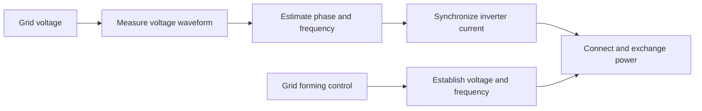

Grid synchronization is the process of matching an incoming power source (such as a generator, solar inverter, or wind turbine) to an electrical grid's alternating current (AC) parameters before connecting them. [^lqlqn4] [^5nroc3] [^zs6r28] [^fhh9c4] 
## Key Parameters to Match
To safely link a source to the grid via a circuit breaker, four primary electrical conditions must align:

* Voltage Magnitude: The incoming voltage must closely match the grid's voltage level.
* Frequency: The alternating speed (measured in Hertz, such as 60 Hz in North America or 50 Hz in Europe) must be identical.
* Phase Angle: The wave peaks and troughs of the AC voltage must line up in time so there is no phase shift.
* Phase Sequence: The rotational order of the three-phase power lines must be wired in the exact same sequence. [^lqlqn4] [^zs6r28] [^0futpu] [^ck6vwa] [^vs4fuh] [^t2tmkn] 

## Why It Matters

* Prevents Equipment Damage: Unsynchronized connections act like a short circuit, creating massive circulating currents that can burn out windings, trip breakers, or destroy transformers.
* Maintains Stability: It allows power plants, battery energy storage systems (BESS), and renewable generators to smoothly inject power into the network without causing voltage dips or frequency swings.
* How It’s Controlled: Traditional plants use mechanical devices like a synchroscope, while modern renewable inverters rely on digital algorithms like a Phase-Locked Loop (PLL) to track the grid waveform in real time. [^lqlqn4] [^5nroc3] [^zs6r28] [^ck6vwa] [^y2j6du] [^5jz7wj] 

[[Wide-Area Synchronous Grid]]

# Defining and Describing Grid Synchronization

- _Grid synchronization is the control process that keeps a power converter, generator, or network aligned with the grid’s voltage, frequency, and phase._
- In power systems, synchronization enables grid-connected equipment to determine the grid’s **frequency and phase angle**, which are required for high-performance control of power converters. [^bvq4ka] In normal operation, interconnected power systems operate synchronously, with frequencies held near the nominal 50 or 60 Hz and power flows balancing supply and demand. [^3oxsze]
- The concept applies when generators are connected to a live bus, when renewable-energy inverters exchange power with an existing grid, and when microgrids transition between islanded and grid-connected operation. [^m1f5mt] [^y454ts] It matters because an incorrect phase or frequency match can produce current transients, voltage disturbances, instability, or unsuccessful breaker closing. [^y454ts]
- In conventional **grid-following** control, a phase-locked loop, or PLL, estimates the grid-voltage angle and frequency so the inverter can inject synchronized current. [^oc8tx7] [^bvq4ka] In **grid-forming** control, the inverter instead establishes a voltage and frequency reference, allowing operation during weak-grid conditions, islanding, and black start. [^oc8tx7] [^vejdj1]

# Uses in Context

- **Renewable-energy integration:** Grid synchronization describes how photovoltaic and wind converters estimate grid phase and frequency before delivering power. [^bvq4ka] [^qnbz4i]
- **Inverter control:** Engineers use the term for PLL-based techniques such as synchronous-reference-frame PLLs, SOGI-PLLs, and enhanced PLLs. [^bvq4ka] [^xvus3y]
- **Weak-grid analysis:** Synchronization is invoked when assessing whether a grid-following inverter remains stable as the network’s short-circuit strength declines. [^oc8tx7] [^hsil6y]
- **[[Microgrid Operations]]:** The term describes matching voltage magnitude, frequency, and phase angle before a generator or inverter closes its breaker to an energized bus. [^m1f5mt] [^y454ts]
- **Black start and islanding:** Grid synchronization distinguishes equipment that follows an existing reference from grid-forming equipment that can establish one on a dead bus. [^m5hpgi] [^vejdj1] [^jay9sx]
- **Power-system stability:** Researchers use synchronization to describe the coordinated state in which network frequencies remain equal and supply and demand remain balanced. [^3oxsze]

# History of Use

## Origins

- The modern engineering usage is rooted in synchronous-machine operation: a generator must match a bus’s **voltage magnitude, frequency, and phase angle** before connection. [^m1f5mt]
- In power-electronics research, the term became closely associated with phase-locked-loop methods for extracting grid phase and frequency. The synchronous-reference-frame PLL, or SRF-PLL, became the most widely used practical method for grid synchronization of converters. [^bvq4ka]
- The concept is therefore not attributable to a single modern technology company. It developed through power-system engineering, control theory, and academic work on PLL-based converter control. [^bvq4ka] [^xvus3y]

## Evolution

- **Conventional synchronous generation:** Synchronization primarily meant matching a generator to an energized utility bus before breaker closure, using control of mechanical speed, excitation, and phase angle. [^m1f5mt]
- **Grid-connected power electronics:** As wind and solar converters expanded, PLL-based synchronization became central to controlling inverter current under balanced, unbalanced, distorted, and weak-grid conditions. [^bvq4ka] [^xvus3y] [^9gf0jt]
- **Grid-forming systems:** More recent work broadened synchronization beyond following a grid reference. Grid-forming inverters can establish voltage and frequency, support islanded operation, and contribute to black start, while virtual-synchronous-machine approaches emulate selected behaviors of synchronous generators. [^oc8tx7] [^vejdj1] [^jay9sx] [^cskdy4]

# Best Real-World Examples

- [Synchronous-reference-frame PLL](https://www.nature.com/articles/s41598-025-21621-2) — a widely used method for estimating grid phase and frequency in converter controls. [^bvq4ka]
- [SOGI-PLL and enhanced PLL research](https://www.scribd.com/document/987936998/4-an-Investigation-of-PLL-Synchronization-Techniques-for-Distributed) — alternative synchronization methods evaluated under voltage sags and harmonics. [^xvus3y]
- [Grid-following photovoltaic and wind inverters](https://www.scribd.com/document/969447109/Control-Strategies-of-Grid-Interfaced-Wind-Energy-Conversion-System-an-Overview) — converters that use PLL-based synchronization to inject current into an existing grid. [^qnbz4i]
- [Grid-forming battery energy-storage systems](https://mosfe.com/article/voltage-and-frequency-stability-in-off-grid-solar-storage-microgrids) — storage converters that establish the voltage and frequency reference for an islanded microgrid. [^m1f5mt]
- [Bronzeville Community Microgrid testing](https://impedyme.com/resource-center/hil-testing-microgrid-renewable/) — a hardware-in-the-loop study involving black-start and sustained coordinated operation of a community microgrid. [^oc8tx7]
- [Virtual synchronous machines](https://spectrum.ieee.org/virtual-synchronous-machines) — inverter controls designed to reproduce selected synchronization and stability behavior associated with synchronous machines. [^cskdy4]
- [Multi-stage grid-forming black-start strategies](https://www.mdpi.com/1996-1073/19/7/1715) — research combining voltage startup, adaptive droop, and phase-angle control before grid connection. [^anvty8]

# Case Studies

**Bronzeville Community Microgrid.** NREL-associated hardware-in-the-loop testing evaluated the Bronzeville Community Microgrid using detailed electromagnetic-transient modeling and DNP3 communications. [^oc8tx7] The test cases included islanded energy management, black start, and coordinated generation sustained for as long as 24 hours in the simulated environment. [^oc8tx7] The case illustrates that synchronization is not only a local PLL function: it is also a system-level coordination problem involving controllers, communications, protection, and transitions between grid-connected and islanded states. [^oc8tx7]

**Weak-grid inverter stability.** Grid-following inverters depend on an external voltage reference and commonly use a PLL to track its phase. [^oc8tx7] [^9gf0jt] Under weak-grid conditions, the interaction between PLL dynamics and network impedance can produce poorly damped oscillations; one reported analysis identified a 5–10 Hz oscillatory mode whose damping worsened as the neighboring solar plants were dispatched at high output. [^hsil6y] Reducing PLL bandwidth improved damping but slowed reactive response, creating a trade-off between synchronization robustness and voltage-support performance. [^hsil6y] The case shows why synchronization must be designed together with network strength, converter controls, and protection rather than treated as an isolated measurement task.

**Grid-forming microgrid black start.** In an off-grid solar-storage microgrid, the battery power-conversion system can act as the grid-forming unit by establishing the AC-bus voltage and frequency. [^m1f5mt] [^y454ts] The startup sequence begins with the storage converter energizing the bus, after which photovoltaic inverters and other sources synchronize to the reference before their breakers close. [^y454ts] A PLL-based unit cannot independently start a dead grid because it has no external voltage waveform to track, whereas grid-forming control can energize the bus and pick up load in stages. [^m5hpgi] [^jay9sx] This demonstrates the conceptual shift from synchronization as *following* an established grid to synchronization as a coordinated transition between independently controlled voltage sources.

***

# Sources

[^oc8tx7]: [Hardware in the Loop Testing for Microgrid & Renewable](https://impedyme.com/resource-center/hil-testing-microgrid-renewable/)
[^m5hpgi]: [Grid-Forming Inverter Explained: Operation & Compliance](https://www.kitecompliance.ai/vertical-compliance/grid-forming-inverter)
[^m1f5mt]: [Voltage and Frequency Stability in Off-Grid Solar-Storage Microgrids — MOSFE](https://mosfe.com/article/voltage-and-frequency-stability-in-off-grid-solar-storage-microgrids)
[^y454ts]: [mosfe.com › article › stability-control-in-off-gridStability Control in Off-Grid PV-Battery Microgrids — MOSFE](https://mosfe.com/article/stability-control-in-off-grid-pv-battery-microgrids)
[^vejdj1]: [What Is Grid-Forming vs Grid-Following Control? - HT Infinite Power](https://www.infinitepowerht.com/grid-forming-and-grid-following.html)
[^bvq4ka]: [Variable gradient-based phase locked loop for accurate frequency estimation of distorted grids](https://www.nature.com/articles/s41598-025-21621-2)
[^xvus3y]: [[4] an Investigation of PLL Synchronization Techniques for ...](https://www.scribd.com/document/987936998/4-an-Investigation-of-PLL-Synchronization-Techniques-for-Distributed)
[^jay9sx]: [Grid-Forming vs Grid-Following Inverters for Battery Hybrid ...](https://www.surgepv.com/blog/grid-forming-vs-grid-following-inverter)
[^qnbz4i]: [Control Strategies of Grid Interfaced Wind Energy Conversion System](https://www.scribd.com/document/969447109/Control-Strategies-of-Grid-Interfaced-Wind-Energy-Conversion-System-an-Overview)
[^anvty8]: [Multi-Stage Black-Start Strategy for Pure New Energy Power Grid Based on Grid-Forming Energy Systems](https://www.mdpi.com/1996-1073/19/7/1715)
[11]: [BESS Black Start Failure Analysis: How Grid-Forming Droop ...](https://www.pcenersys.com/blog/bess-black-start-failure-analysis-grid-forming-droop-control.html)
[^hsil6y]: [Grid-Forming vs Grid-Following BESS Inverters - Keentel Engineering](https://keentelengineering.com/grid-forming-vs-grid-following-bess)
[^3oxsze]: [Enhancing power grid synchronization and stability ...](https://arxiv.org/html/1901.05201v2)
[^cskdy4]: [Virtual Synchronous Machines: A Grid Stability Solution](https://spectrum.ieee.org/virtual-synchronous-machines)
[^9gf0jt]: [RMS-Based PLL Stability Limit Estimation Using Maximum Phase Error for Power System Planning in Weak Grids](https://www.mdpi.com/1996-1073/19/1/281)
[^lqlqn4]: [https://elintacharge.com](https://elintacharge.com/glossary/grid-synchronization/)
[^5nroc3]: [https://www.youtube.com](https://www.youtube.com/watch?v=OhsNgiRrc2k&t=50)
[^zs6r28]: [https://www.youtube.com](https://www.youtube.com/watch?v=kkwH-_3G040&t=8)
[^fhh9c4]: [https://www.youtube.com](https://www.youtube.com/watch?v=w1cE2H6pRvE)
[^0futpu]: [https://en.wikipedia.org](https://en.wikipedia.org/wiki/Wide_area_synchronous_grid)
[^ck6vwa]: [https://www.linkedin.com](https://www.linkedin.com/posts/yasir-ali-534270106_what-is-synchronization-where-it-is-used-activity-7219307954552901634--O21)
[^vs4fuh]: [https://www.linkedin.com](https://www.linkedin.com/posts/amirat-ahmed-91806843_what-is-synchronization-where-it-is-used-activity-7355268342607147008-4mxe)
[^t2tmkn]: [https://www.linkedin.com](https://www.linkedin.com/posts/engr-patience-francis-aa817691_powersystems-powergeneration-hydropower-activity-7495484735432056832-eKTN)
[^y2j6du]: [https://ieeexplore.ieee.org](https://ieeexplore.ieee.org/document/9972611/)
[^5jz7wj]: [https://www.linkedin.com](https://www.linkedin.com/posts/imanakash26_solarpowerplant-gridsynchronization-electricalengineering-activity-7484988332977049600-CmXB)
